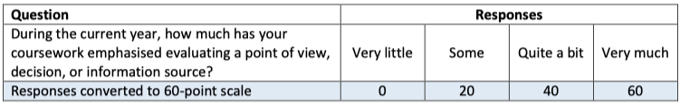

```{r setup, include=FALSE}
library(bslib)
library(shiny)
library(reactable)
library(tidyverse)
library(readxl)
library(likert)
library(plyr)
library(naniar)
library(shinycssloaders)
library(waiter)
library(fmsb)

knitr::opts_chunk$set(echo = FALSE)
Data <- read_excel(params$n, sheet = "Data")
avgr<- params$avgr
course<- params$course
#course<- "Course 2"
```
## Introduction

<center>{width="600"}</center>

<br> <br> <br>

**Purpose**

StudentSurvey.ie (the Irish Survey of Student Engagement; Suirbhé na hÉireann ar Rannpháirtíocht na Mac Léinn) asks students directly about their experiences of higher education in Ireland, including their academic, personal, and social development. For the purposes of StudentSurvey.ie, student engagement reflects two key elements. The first is the amount of time and effort that students put into their studies and other educationally beneficial activities. The second is how institutions deploy resources and organise curriculum and learning opportunities to encourage students to participate in meaningful activities linked to learning.

**Method**

The focus of the survey is on student engagement with learning, rather than student satisfaction. Student engagement with college life is important in enabling them to develop key capabilities, such as critical thinking, problem-solving, writing skills, team-work, and communication skills. The comprehensive survey consists of 64 questions, grouped by the engagement 'indicator' to which they relate. There is an additional body of questions that do not directly relate to a specific indicator, but that are included in the survey because of their contribution to a broad understanding of student engagement. Each indicator score is calculated from responses to the multiple questions that relate to that indicator.

The indicators are:

Higher-Order Learning Student-Faculty Interaction Reflective and Integrative Learning Effective Teaching Practices Quantitative Reasoning Quality of Interactions Learning Strategies Supportive Environment Collaborative Learning Learning, Creative and Social Skills

There is a second survey, which is designed for postgraduate research (PGR) students (Masters by Research and PhD students). PGR StudentSurvey.ie runs every two years, with the next fieldwork period scheduled for spring 2023.

**How is the indicator score for each indicator calculated?**

Indicator scores are NOT percentages but rather represent relative performance. They are calculated scores to enable interpretation of the data at a higher level than individual questions, i.e., to act as signposts to help the reader to navigate the large data set. Responses to questions are converted to a 60-point scale, with the lowest response placed at 0 and the highest response placed at 60. The following question is used to illustrate this point.



Indicator scores are calculated for a respondent when they answer all or almost all related questions. The exact number of responses required varies according to the indicator, based on psychometric testing undertaken for the North American National Survey of Student Engagement (NSSE).

The indicator score is calculated from the weighted mean of (non-blank) responses given. Indicator scores for any particular student group -- for example, the first year undergraduate cohort -- are calculated as the mean of individual indicator scores.

Consequently, and crucially, indicator scores cannot be combined across indicators to calculate an average overall indicator score in any meaningful or statistically sound way.

<br><br><br><br><br><br><br><br><br><br><br><br><br><br><br><br><br><br><br><br>


   

 
```{r include=FALSE}

AllStudentSurvey.ie<-    data.frame(
      stringsAsFactors = FALSE,
                        rowname = c("CL","ET",
                                                 "HO","LS","LC","QI","QR",
                                                 "RI","SF","SE"),
                                          Y1 = c(28.52,
                                                 32.64,33.52,31.08,31.63,38.58,
                                                 19.16,30.46,10.91,29.92),
                                          YF = c(30.96,
                                                 31.76,34.19,30.96,33.9,36.95,
                                                 21.57,31.73,14.96,26.2),
                                         PGT = c(28.15,
                                                 35.59,38.26,34.9,35.02,40.05,
                                                 22.99,35.5,15.09,28.16)
                      )

  
Universities<-    data.frame(
               stringsAsFactors = FALSE,
                    rowname = c("CL","ET","HO",
                                                      "LS","LC","QI","QR","RI",
                                                      "SF","SE"),
                                               Y1 = c(28.21,31.4,34.74,
                                                      31.45,31.41,37.66,19.68,
                                                      31.34,8.94,30.64),
                                               YF = c(30.26,31.09,35.55,
                                                      31.62,34.31,36.47,22.6,
                                                      32.72,14.01,26.72),
                                              PGT = c(28.89,35.66,38.81,
                                                      34.98,35.26,39.89,23.34,
                                                      36.42,15.8,28.49)
                  )

  
  
Higher.Education.Institutions<-   data.frame(
                                                                                                                                                                                   stringsAsFactors = FALSE,
                                                                                                   NA,
                                    rowname = c("CL","ET","HO",
                                                                                                     "LS","LC","QI",
                                                                                                     "QR","RI","SF",
                                                                                                     "SE"),
                                                                                              Y1 = c(29.28,33.75,
                                                                                                     31.86,30.22,31.68,
                                                                                                     39.28,19.05,29.05,
                                                                                                     13.33,29.04),
                                                                                              YF = c(31.38,32.4,
                                                                                                     32.99,30.39,33.53,
                                                                                                     37.08,21.14,30.7,
                                                                                                     15.87,25.49),
                                                                                             PGT = c(24.89,35.23,
                                                                                                     36.81,34.08,33.84,
                                                                                                     39.74,21.5,33.09,
                                                                                                     12.8,26.44)
                                  )
  
  
  
Other.Institutions<- data.frame(
                     stringsAsFactors = FALSE,
                       rowname = c("CL","ET",
                                                               "HO","LS","LC","QI",
                                                               "QR","RI","SF",
                                                               "SE"),
                                                        Y1 = c(26.66,34.98,
                                                               34.12,33.09,32.79,
                                                               40.98,16.39,31.93,
                                                               11.38,29.69),
                                                        YF = c(32.14,31.49,
                                                               34.14,30.96,33.92,
                                                               38.69,18.65,32.79,
                                                               14.5,27.66),
                                                       PGT = c(28.7,35.7,
                                                               37.41,35.51,35.34,
                                                               41.03,23.16,34.21,
                                                               14.61,28.73)
                     )


avga=data.frame(0)
       ifelse(avgr=="All StudentSurvey.ie",avga<-AllStudentSurvey.ie,
              ifelse(avgr=="StudentSurvey.ie Universities",avga<-Universities,
                     ifelse(avgr=="StudentSurvey.ie Technological Higher Education Institutions",avga<-Higher.Education.Institutions,
                             ifelse(avgr=="StudentSurvey.ie Other Institutions",avga<-Other.Institutions,0))))
       
       

```

```{r include=FALSE}
StudentSurvey.ie2<-   data.frame(
          CL = c(29.18),
          ET = c(33.08),
          HO = c(34.87),
          LS = c(31.96),
          LC = c(33.16),
          QI = c(38.39),
          QR = c(20.82),
          RI = c(32.02),
          SF = c(13.17),
          SE = c(28.33)
                     )


Universities2<-  data.frame(
          CL = c(28.93),
          ET = c(32.64),
          HO = c(36.21),
          LS = c(32.57),
          LC = c(33.35),
          QI = c(38),
          QR = c(21.54),
          RI = c(33.21),
          SF = c(12.32),
          SE = c(28.97)
                  )  

Higher.Education.Institutions2<- data.frame(
          CL = c(29.64),
          ET = c(33.37),
          HO = c(32.88),
          LS = c(30.72),
          LC = c(32.67),
          QI = c(38.41),
          QR = c(20.17),
          RI = c(30.15),
          SF = c(14.3),
          SE = c(27.31)
                                  )  


Other.Institutions2<- data.frame(
          CL = c(28.74),
          ET = c(34.36),
          HO = c(35.33),
          LS = c(33.44),
          LC = c(34.02),
          QI = c(40.35),
          QR = c(19.45),
          RI = c(32.96),
          SF = c(13.35),
          SE = c(28.81)
                     )


avgm=data.frame(0)
  ifelse(avgr=="All StudentSurvey.ie",avgm<-StudentSurvey.ie2,
              ifelse(avgr=="StudentSurvey.ie Universities",avgm<-Universities2,
                     ifelse(avgr=="StudentSurvey.ie Technological Higher Education Institutions",avgm<-Higher.Education.Institutions2,
                             ifelse(avgr=="StudentSurvey.ie Other Institutions",avgm<-Other.Institutions2,0))))
       


```


```{r fig.align='center'}
    High_level<-Data%>% filter(CourseNm==course)  %>% dplyr::select(Weighting_var, "HO","RI","QR","LS","CL","SF","ET","QI","SE","LC") %>%   dplyr::summarise(across(2:11,~ weighted.mean(., Weighting_var, na.rm = TRUE))) 


names(High_level)<- c(
  HO="Higher-Order Learning",
  RI="Reflective and Integrative Learning",
  QR="Quantitative Reasoning",
  LS="Learning Strategies",
  CL="Collaborative Learning",
  SF="Student-Faculty Interaction",
  ET="Effective Teaching Practices",
  QI="Quality of Interactions",
  SE="Supportive Environment",
  LC="Learning, Creative and Social Skills"
)


Data %>% filter(CourseNm==course)  %>% dplyr::group_by(study_group) %>% dplyr::summarise(n=n()) %>% 
                    reactable(  compact = T,  wrap = TRUE)


```


   

    

    

 

```{r cars, fig.height=5, fig.width=15}
#Data <- read_excel(n, sheet = "Data")
library(gt)

 High_level<-Data %>%filter(CourseNm==course) %>% dplyr::group_by(study_group) %>% dplyr::select(Weighting_var, study_group, "HO","RI","QR","LS","CL","SF","ET","QI","SE","LC") %>%   dplyr::summarise(across(2:11,~ weighted.mean(., Weighting_var, na.rm = TRUE))) 

    
  
  names(High_level)<- c(
    study_group="study_group",
    HO="Higher-Order Learning",
    RI="Reflective and Integrative Learning",
    QR="Quantitative Reasoning",
    LS="Learning Strategies",
    CL="Collaborative Learning",
    SF="Student-Faculty Interaction",
    ET="Effective Teaching Practices",
    QI="Quality of Interactions",
    SE="Supportive Environment",
    LC="Learning, Creative and Social Skills"
  )
  High_level<-as.data.frame(High_level)
  rownames(High_level) <- High_level$study_group
  High_level$study_group <- NULL
  transpose <- as.data.frame(t(as.matrix(High_level)))
  BuYlRd <- function(x) rgb(colorRamp(c("#eb5528", "#ffffbf", "#42a145"))(x), maxColorValue = 255)

transpose %>% round(1) %>%   gt(rownames_to_stub = T,
  auto_align = TRUE)  %>% 
  tab_header(
    title = "Indicator overview",
    subtitle = course) %>% 
  data_color(
    columns = everything(),
    colors = scales::col_numeric(
      palette = BuYlRd,
      domain = c(0, 60)
    )
  )

```


   

    
```{r fig.height=5, fig.width=12}

High_level<-Data %>% dplyr::filter(CourseNm==course)  %>% dplyr::group_by(study_group) %>% dplyr::select(Weighting_var, study_group, "HO","RI","QR","LS","CL","SF","ET","QI","SE","LC") %>%  dplyr::summarise(across(2:11,~ weighted.mean(., Weighting_var, na.rm = TRUE))) 

  
 
  
  #Transpose
  High_level<-as.data.frame(High_level)
  rownames(High_level) <- High_level$study_group
  High_level$study_group <- NULL
  transpose <- as.data.frame(t(as.matrix(High_level)))
  #transpose <- transpose(High_level)
  rownames(transpose) <- colnames(High_level)
  colnames(transpose) <- rownames(High_level)
  
  
  #Color function
  BuYlRd <- function(x) rgb(colorRamp(c("#eb5528", "#ffffbf", "#42a145"))(x), maxColorValue = 255)

  
  
  transpose<-transpose %>% rownames_to_column() %>% 
    pivot_longer(.,names(transpose))
  

  
  
  # avg<-data.frame(
  #   stringsAsFactors = FALSE,
  #   rowname = c("HO","HO","HO","RI",
  #               "RI","RI","QR","QR","QR","LS","LS","LS","CL","CL",
  #               "CL","SF","SF","SF","ET","ET","ET","QI","QI",
  #               "QI","SE","SE","SE"),
  #   name = c("PGT","Y1","YF","PGT",
  #            "Y1","YF","PGT","Y1","YF","PGT","Y1","YF","PGT",
  #            "Y1","YF","PGT","Y1","YF","PGT","Y1","YF",
  #            "PGT","Y1","YF","PGT","Y1","YF"),
  #   value2 = c(30.58333,29.6,28.23077,
  #              16.3081,17.944,15.63492,32.551,34.82828,
  #              33,45.034014,37.626263,32.537634,24.4118,
  #              15.40845,34.29167,13.25,8.695,10.193548,46.361702,
  #              30.09677,38.38462,30.15789,28.5,37.9,
  #              18.94595,24.90012,18.94595)
  # )
  # 
  
  
 avg<- avga
  
  
  
  
  
  
  
  avg<-avg %>% gather(key="name",value="value2", -rowname)
  
  
  transpose<-merge(x = transpose, y = avg, by = c("rowname","name"), all.x = TRUE)
  
  
  
  options(scipen=999)
  
  transpose<-transpose %>% mutate(diff=value-value2)
  
  transpose$rowname<-recode_factor(transpose$rowname,
                                   HO="Higher-Order Learning",
                                   RI="Reflective and Integrative Learning",
                                   QR="Quantitative Reasoning",
                                   LS="Learning Strategies",
                                   CL="Collaborative Learning",
                                   SF="Student-Faculty Interaction",
                                   ET="Effective Teaching Practices",
                                   QI="Quality of Interactions",
                                   SE="Supportive Environment",
                                  LC="Learning, Creative and Social Skills"
  )
  
  ggplot(transpose,aes(x=factor(rowname), y=diff, fill=name))+ geom_bar( stat='identity', position=position_dodge())+
    theme_bw()+  xlab("Indicators")+
    theme(axis.text.x=element_text(angle=45, hjust=1, size=8))+
    facet_grid(cols=vars(rowname),scales = "free_x")+
    geom_text(aes(label=sprintf("%2.1f", diff)), angle=90,position = position_dodge(width = .9),size=3)+ggtitle("Difference from national Average")+
    geom_hline(yintercept=0)+
    scale_fill_manual(values=c("#999999", "#E69F00", "#56B4E9"))+
      theme(panel.grid.major = element_blank(),
            strip.text.x = element_blank())


```


