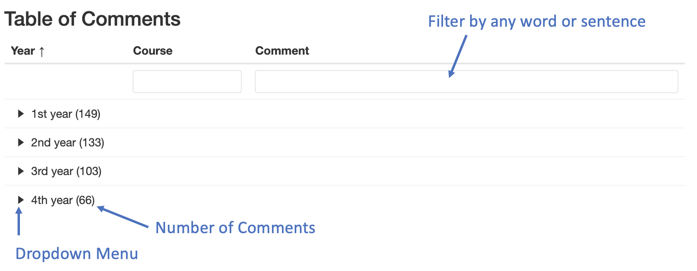

<!-- #  {.tabset .tabset-fade} -->

## Introduction

<center>{width="600"}</center>

<br> <br> <br>

**Purpose**

StudentSurvey.ie (the Irish Survey of Student Engagement; Suirbhé na hÉireann ar Rannpháirtíocht na Mac Léinn) asks students directly about their experiences of higher education in Ireland, including their academic, personal, and social development. For the purposes of StudentSurvey.ie, student engagement reflects two key elements. The first is the amount of time and effort that students put into their studies and other educationally beneficial activities. The second is how institutions deploy resources and organise curriculum and learning opportunities to encourage students to participate in meaningful activities linked to learning.

**Method**

The focus of the survey is on student engagement with learning, rather than student satisfaction. Student engagement with college life is important in enabling them to develop key capabilities, such as critical thinking, problem-solving, writing skills, team-work, and communication skills. The comprehensive survey consists of 64 questions, grouped by the engagement 'indicator' to which they relate. There is an additional body of questions that do not directly relate to a specific indicator, but that are included in the survey because of their contribution to a broad understanding of student engagement. Each indicator score is calculated from responses to the multiple questions that relate to that indicator.

The indicators are:

Higher-Order Learning Student-Faculty Interaction Reflective and Integrative Learning Effective Teaching Practices Quantitative Reasoning Quality of Interactions Learning Strategies Supportive Environment Collaborative Learning Learning, Creative and Social Skills

There is a second survey, which is designed for postgraduate research (PGR) students (Masters by Research and PhD students). PGR StudentSurvey.ie runs every two years, with the next fieldwork period scheduled for spring 2023.

**How is the indicator score for each indicator calculated?**

Indicator scores are NOT percentages but rather represent relative performance. They are calculated scores to enable interpretation of the data at a higher level than individual questions, i.e., to act as signposts to help the reader to navigate the large data set. Responses to questions are converted to a 60-point scale, with the lowest response placed at 0 and the highest response placed at 60. The following question is used to illustrate this point.


Indicator scores are calculated for a respondent when they answer all or almost all related questions. The exact number of responses required varies according to the indicator, based on psychometric testing undertaken for the North American National Survey of Student Engagement (NSSE).

The indicator score is calculated from the weighted mean of (non-blank) responses given. Indicator scores for any particular student group -- for example, the first year undergraduate cohort -- are calculated as the mean of individual indicator scores.

Consequently, and crucially, indicator scores cannot be combined across indicators to calculate an average overall indicator score in any meaningful or statistically sound way.

<br><br><br><br><br><br><br><br><br><br><br><br><br><br><br><br><br><br><br><br>

## General

### Response numbers

```{r setup, include=FALSE}
knitr::opts_chunk$set(
	echo = FALSE,
	message = FALSE,
	warning = FALSE,
  error = TRUE
)
```

```{r}

library(readxl)
library(tidyverse)
library(likert)
library(plyr)
library(data.table)
library(reactable)
library(naniar)
library(gt)
library(fmsb)
library(grid)
library(knitr)

# Data <- read_excel("~/Downloads/Mary Immaculate College, Limerick Data File 2023.xlsx", 
#     sheet = "Data")
# ngramnum=4
# avgr="All StudentSurvey.ie"


Data <- read_excel(params$n, sheet = "Data")
ngramnum<- params$obs
avgr<- params$avgr


    percent <- function(x, digits = 1, format = "f", ...) {
        paste0(formatC(100 * x, format = format, digits = digits, ...), "%")
    }


Data=Data %>% dplyr::rename(sex=gender,
                       Weighting_var=	weighting_var,
instCd=	institution,
Inst_group=	institution_group,
Age_group=	age_group,
domicile =	domicile,
Domicile_group=	domicile_group,
county=	county,
study_group=	cohort,
nqai	=nqai,
ProgTy=	prog_type,
studyMd	=study_mode,
Mode_of_Study=	study_mode_grouped,
# nsAttend=	non_standard_attend,
# exchang=	exchange,
stuCd	=student_code,
courseYr=	course_year,
courseCd=	course_code,
CourseNm=	course_name,
AcUnit1=	acunit1,
AcUnit2	=acunit2,
AcUnit3	=acunit3,
# AcUnit4=	acunit4,
Hoapply=hoapply,
Hoanalyze=hoanalyze,
Hoevaluate=hoevaluate,
Hoform=hoform,
Riintegrate=riintegrate,
Risocietal=risocietal,
Ridiverse=ridiverse,
Riownview=riownview,
Riperspect=riperspect,
Rinewview=rinewview,
Riconnect=riconnect,
Qrconclude=qrconclude,
Qrproblem=qrproblem,
Qrevaluate=qrevaluate,
Lsreading=lsreading,
Lsnotes=lsnotes,
Lssummary=lssummary,
Claskhelp=claskhelp,
Clexplain=clexplain,
Clstudy=clstudy,
Clproject=clproject,
Sfcareer=sfcareer,
Sfotherwork=sfotherwork,
Sfdiscuss=sfdiscuss,
Sfperform=sfperform,
Etgoals=etgoals,
Etorganize=etorganize,
Etexample=etexample,
Etdraftfb=etdraftfb,
Etfeedback=etfeedback,
Qistudent=qistudent,
Qiadvisor=qiadvisor,
Qifaculty=qifaculty,
Qistaff=qistaff,
Qiadmin=qiadmin,
Seacademic=seacademic,
Selearnsup=selearnsup,
Sediverse=sediverse,
Sesocial=sesocial,
Sewellness=sewellness,
Senonacad=senonacad,
Seactivities=seactivities,
Seevents=seevents,
lcwrite=lcwrite,
lcspeak=lcspeak,
lcthink=lcthink,
lcanalyse=lcanalyse,
lcwork=lcwork,
lcothers=lcothers,
lcprobsolve=lcprobsolve,
lccitizen=lccitizen,
lccreative=lccreative,
askquest=askquest,
unprepared=unprepared,
present=present,
applylrn=applylearning,
exrcse=exercise,
tmservice=volunteering,
profexp=profexp,
assesslearn=assesslearn,
evalexp=overall_evaluation,
sameinst=same_institution,
withdrawal_1=withdrawal1,
withdrawal_2=withdrawal2,
withdrawal_3=withdrawal3,
withdrawal_4=withdrawal4,
withdrawal_5=withdrawal5,
withdrawal_6=withdrawal6,
withdrawal_7=withdrawal7,
withdrawal_other=withdrawal_other,
best_aspects=best_aspects,
improve_how=improvements,
# t1_career_1=t1career1,
# t1_career_2=t1career2,
# t1_confidence_1=t1confidence1,
# t1_confidence_2=t1confidence2,
# t1_confidence_3=t1confidence3,
# t1_confidence_4=t1confidence4,
# t1_confidence_5=t1confidence5,
# t1_plan_1=t1plan1,
# t1_plan_2=t1plan2,
# t1_plan_3=t1plan3,
# t1_plan_4=t1plan4,
# t1_plan_5=t1plan5,
# t1_plan_6=t1plan6,
# t5feedback=t1feedback,
# t2_emphasise_1=t2emphasise1,
# t2_emphasise_2=t2emphasise2,
# t2_emphasise_3=t2emphasise3,
# t2_emphasise_4=t2emphasise4,
# t2_important_1=t2important1,
# t2_important_2=t2important2,
# t2_important_3=t2important3,
# t3_comfortable_1=t3comfortable1,
# t3_comfortable_2=t3comfortable2,
# t3_comfortable_3=t3comfortable3,
# t3_comfortable_4=t3comfortable4,
# t3_comfortable_5=t3comfortable5,
# t3_comfortable_6=t3comfortable6,
# t3_comfortable_7=t3comfortable7,
# t3_comfortable_8=t3comfortable8,
# t3_improve_1=t3improve1,
# t3_improve_2=t3improve2,
# t3_improve_3=t3improve3,
# t3_improve_4=t3improve4,
# t3_improve_5=t3improve5,
# t3_improve_6=t3improve6,
# t3_experience_1=t3experience1,
# t3_experience_2=t3experience2,
# t3_experience_3=t3experience3,
# t3_experience_4=t3experience4,
# t3_experience_5=t3experience5,
# t3_feedback=t3feedback,
# t4_coursework_1=t4coursework1,
# t4_coursework_2=t4coursework2,
# t4_coursework_3=t4coursework3,
# t4_coursework_4=t4coursework4,
# t4_institution_1=t4institution1,
# t4_institution_2=t4institution2,
# t4_institution_3=t4institution3,
# t4_institution_4=t4institution4,
# t4_institution_5=t4institution5,
# t4_activity_1=t4activity1,
# t4_activity_2=t4activity2,
# t4_activity_3=t4activity3,
HO=HO,
Hoapplyh=hoapplyh,
Hoanalyzeh=hoanalyzeh,
Hoevaluateh=hoevaluateh,
Hoformh=hoformh,
RI=RI,
Riintegrateh=riintegrateh,
Risocietalh=risocietalh,
Ridiverseh=ridiverseh,
Riownviewh=riownviewh,
Riperspecth=riperspecth,
Rinewviewh=rinewviewh,
Riconnecth=riconnecth,
QR=QR,
Qrconcludeh=qrconcludeh,
Qrproblemh=qrproblemh,
Qrevaluateh=qrevaluateh,
LS=LS,
Lsreadingh=lsreadingh,
Lsnotesh=lsnotesh,
Lssummaryh=lssummaryh,
CL=CL,
Claskhelph=claskhelph,
Clexplainh=clexplainh,
Clstudyh=clstudyh,
Clprojecth=clprojecth,
SF=SF,
Sfcareerh=sfcareerh,
Sfotherworkh=sfotherworkh,
Sfdiscussh=sfdiscussh,
Sfperformh=sfperformh,
ET=ET,
Etgoalsh=etgoalsh,
Etorganizeh=etorganizeh,
Etexampleh=etexampleh,
Etdraftfbh=etdraftfbh,
Etfeedbackh=etfeedbackh,
QI=QI,
Qistudenth=qistudenth,
Qiadvisorh=qiadvisorh,
Qifacultyh=qifacultyh,
Qistaffh=qistaffh,
Qiadminh=qiadminh,
SE=SE,
Seacademich=seacademich,
Selearnsuph=selearnsuph,
Sediverseh=sediverseh,
Sesocialh=sesocialh,
Sewellnessh=sewellnessh,
Senonacadh=senonacadh,
Seactivitiesh=seactivitiesh,
Seeventsh=seeventsh,
LC=LC,
lcwriteh=lcwriteh,
lcspeakh=lcspeakh,
lcthinkh=lcthinkh,
lcanalyseh=lcanalyseh,
lcothersh=lcothersh,
lcprobsolveh=lcprobsolveh,
lccitizenh=lccitizenh,
lccreativeh=lccreativeh)  


Data <- Data %>% 
  mutate(study_group = dplyr::recode(study_group, "1" = "Y1", "2" = "YF", "3" = "PGT"))

    
```


```{r include=FALSE}


AllStudentSurvey.ie<-    data.frame(
  stringsAsFactors = FALSE,
           rowname = c("HO","RI","QR","LS","CL",
                       "SF","ET","QI","SE","LC"),
                Y1 = c(33.76,30.67,19.69,31.32,
                       29.91,11.79,32.67,40.63,30.97,31.9),
                YF = c(34.81,32.06,22.16,31.24,
                       31.48,15.72,31.72,38.95,26.51,33.83),
               PGT = c(38.85,36.12,23.87,35.27,
                       29.1,16.5,36.03,42.6,29.64,35.51)
)


  
Universities<-    data.frame(
  stringsAsFactors = FALSE,
           rowname = c("HO","RI","QR","LS","CL",
                       "SF","ET","QI","SE","LC"),
                Y1 = c(34.93,31.49,20.16,32.14,
                       29.66,9.55,31.77,39.94,31.76,31.8),
                YF = c(36.32,33.05,23.35,32.26,
                       31.16,14.19,30.79,38.36,26.71,34.32),
               PGT = c(39.61,37.22,23.79,35.36,
                       29.77,16.94,36.13,42.95,29.9,35.92)
)

  
  
Higher.Education.Institutions<-   data.frame(
  stringsAsFactors = FALSE,
           rowname = c("HO","RI","QR","LS","CL",
                       "SF","ET","QI","SE","LC"),
                Y1 = c(32.06,29.25,19.6,30,30.47,
                       14.4,33.51,41.21,29.98,31.84),
                YF = c(33.45,30.9,21.33,30.37,
                       31.65,16.85,32.67,39.4,26.2,33.36),
               PGT = c(37.45,33.46,22.17,34.63,
                       24.78,14.04,35.57,42.06,28.07,33.55)
)
  
  
  
Other.Institutions<- data.frame(
  stringsAsFactors = FALSE,
           rowname = c("HO","RI","QR","LS","CL",
                       "SF","ET","QI","SE","LC"),
                Y1 = c(35.49,33.37,16.65,33.32,
                       28.14,12.75,34.33,42.28,31.09,32.95),
                YF = c(34.57,33.81,20.25,30.8,
                       32.44,17.65,30.96,39.57,27.37,33.92),
               PGT = c(37.73,35.09,25.83,35.64,
                       31.03,17.51,36.17,41.96,30.32,36.11)
)


avga=data.frame(0)
       ifelse(avgr=="All StudentSurvey.ie",avga<-AllStudentSurvey.ie,
              ifelse(avgr=="StudentSurvey.ie Universities",avga<-Universities,
                     ifelse(avgr=="StudentSurvey.ie Technological Higher Education Institutions",avga<-Higher.Education.Institutions,
                             ifelse(avgr=="StudentSurvey.ie Other Institutions",avga<-Other.Institutions,0))))
       
       

```

```{r include=FALSE}


StudentSurvey.ie2<-   data.frame(
          HO = c(35.22),
          RI = c(32.28),
          QR = c(21.36),
          LS = c(32.19),
          CL = c(30.19),
          SF = c(14.02),
          ET = c(33.15),
          QI = c(40.56),
          SE = c(29.34),
          LC = c(33.3)
)


Universities2<-  data.frame(
          HO = c(36.56),
          RI = c(33.41),
          QR = c(21.96),
          LS = c(33.04),
          CL = c(30.07),
          SF = c(12.73),
          ET = c(32.72),
          QI = c(40.34),
          SE = c(29.96),
          LC = c(33.58)
)

Higher.Education.Institutions2<- data.frame(
          HO = c(33.18),
          RI = c(30.3),
          QR = c(20.52),
          LS = c(30.64),
          CL = c(30.31),
          SF = c(15.27),
          ET = c(33.42),
          QI = c(40.6),
          SE = c(28.36),
          LC = c(32.6)
)


Other.Institutions2<- data.frame(
          HO = c(36.29),
          RI = c(34.24),
          QR = c(21.53),
          LS = c(33.8),
          CL = c(30.36),
          SF = c(15.95),
          ET = c(34.42),
          QI = c(41.52),
          SE = c(29.93),
          LC = c(34.57)
)


avgm <- data.frame(0)
if (avgr == "All StudentSurvey.ie") {
  avgm <- StudentSurvey.ie2
} else if (avgr == "StudentSurvey.ie Universities") {
  avgm <- Universities2
} else if (avgr == "StudentSurvey.ie Technological Higher Education Institutions") {
  avgm <- Higher.Education.Institutions2
} else if (avgr == "StudentSurvey.ie Other Institutions") {
  avgm <- Other.Institutions2
}


```


```{r fig.align='center'}
    High_level<-Data %>% dplyr::select(Weighting_var, "HO","RI","QR","LS","CL","SF","ET","QI","SE","LC") %>%   dplyr::summarise(across(2:11,~ weighted.mean(., Weighting_var, na.rm = TRUE))) 


names(High_level)<- c(
  HO="Higher-Order Learning",
  RI="Reflective and Integrative Learning",
  QR="Quantitative Reasoning",
  LS="Learning Strategies",
  CL="Collaborative Learning",
  SF="Student-Faculty Interaction",
  ET="Effective Teaching Practices",
  QI="Quality of Interactions",
  SE="Supportive Environment",
  LC="Learning, Creative and Social Skills"
)


Data %>% dplyr::group_by(study_group) %>% dplyr::summarise(n=n()) %>% 
                    reactable(  compact = T,  wrap = TRUE)


```

<br><br>

<br><br>

### Indicator overview

Overview of the main indicators broken down by Y1,YF and PGT.

```{r}


#Transpose
High_level<-as.data.frame(High_level)
rownames(High_level) <- High_level$study_group
High_level$study_group <- NULL
transpose <- as.data.frame(t(as.matrix(High_level)))
#transpose <- t(High_level)
#rownames(transpose) <- colnames(High_level)
#colnames(transpose) <- rownames(High_level)
colnames(transpose)<-"Score"
#Color function
BuYlRd <- function(x) rgb(colorRamp(c("#eb5528", "#ffffbf", "#42a145"))(x), maxColorValue = 255)
#Create a table
reactable(
  transpose,compact = T,
  fullWidth = T,
  defaultColDef = colDef(
    style = function(value) {
      if (!is.numeric(value)) return()
      normalized <- (value - min(transpose[1])) / (max(transpose[1]) - min(transpose[1]))
      color <- BuYlRd(normalized)
      list(background = color)
    },
    format = colFormat(percent = F, digits = 1),
    minWidth = 50
  ),
  columns = list(
    "Score" = colDef(width = 55)   # 50% width, 200px minimum
  ),width = 350
)


  High_level<-Data %>% dplyr::group_by(study_group) %>% dplyr::select(Weighting_var, study_group, "HO","RI","QR","LS","CL","SF","ET","QI","SE","LC") %>%  dplyr::summarise(across(2:11,~ weighted.mean(., Weighting_var, na.rm = TRUE))) 

names(High_level)<- c(
  study_group="study_group",
  HO="Higher-Order Learning",
  RI="Reflective and Integrative Learning",
  QR="Quantitative Reasoning",
  LS="Learning Strategies",
  CL="Collaborative Learning",
  SF="Student-Faculty Interaction",
  ET="Effective Teaching Practices",
  QI="Quality of Interactions",
  SE="Supportive Environment",
  LC="Learning, Creative and Social Skills"
)


#Transpose
High_level<-as.data.frame(High_level)
rownames(High_level) <- High_level$study_group
High_level$study_group <- NULL
transpose <- as.data.frame(t(as.matrix(High_level)))
#transpose <- transpose(High_level)
#rownames(transpose) <- colnames(High_level)
#colnames(transpose) <- rownames(High_level)


#Color function
BuYlRd <- function(x) rgb(colorRamp(c("#eb5528", "#ffffbf", "#42a145"))(x), maxColorValue = 255)
#Create a table
reactable(
  transpose,compact = TRUE,
  defaultColDef = colDef(
    style = function(value) {
      if (!is.numeric(value)) return()
      normalized <- (value - min(transpose[1:3])) / (max(transpose[1:3]) - min(transpose[1:3]))
      color <- BuYlRd(normalized)
      list(background = color)
    },
    format = colFormat(percent = F, digits = 1),
    minWidth = 50
  ),
  columns = list(
    "PGT" = colDef(width = 55),
    "Y1" = colDef(width = 55),
    "YF" = colDef(width = 55)),width = 450
)


```

<br><br>

### Comparisons to national average

Comparing the institution to the national average.

```{r fig.height=5, fig.width=12}


High_level<-Data %>% dplyr::group_by(study_group) %>% dplyr::select(Weighting_var, study_group, "HO","RI","QR","LS","CL","SF","ET","QI","SE","LC") %>%  dplyr::summarise(across(2:11,~ weighted.mean(., Weighting_var, na.rm = TRUE))) 

  
 
  
  #Transpose
  High_level<-as.data.frame(High_level)
  rownames(High_level) <- High_level$study_group
  High_level$study_group <- NULL
  transpose <- as.data.frame(t(as.matrix(High_level)))
  #transpose <- transpose(High_level)
  rownames(transpose) <- colnames(High_level)
  colnames(transpose) <- rownames(High_level)
  
  
  #Color function
  BuYlRd <- function(x) rgb(colorRamp(c("#eb5528", "#ffffbf", "#42a145"))(x), maxColorValue = 255)

  
  
  transpose<-transpose %>% rownames_to_column() %>% 
    pivot_longer(.,names(transpose))
  

  
  
  # avg<-data.frame(
  #   stringsAsFactors = FALSE,
  #   rowname = c("HO","HO","HO","RI",
  #               "RI","RI","QR","QR","QR","LS","LS","LS","CL","CL",
  #               "CL","SF","SF","SF","ET","ET","ET","QI","QI",
  #               "QI","SE","SE","SE"),
  #   name = c("PGT","Y1","YF","PGT",
  #            "Y1","YF","PGT","Y1","YF","PGT","Y1","YF","PGT",
  #            "Y1","YF","PGT","Y1","YF","PGT","Y1","YF",
  #            "PGT","Y1","YF","PGT","Y1","YF"),
  #   value2 = c(30.58333,29.6,28.23077,
  #              16.3081,17.944,15.63492,32.551,34.82828,
  #              33,45.034014,37.626263,32.537634,24.4118,
  #              15.40845,34.29167,13.25,8.695,10.193548,46.361702,
  #              30.09677,38.38462,30.15789,28.5,37.9,
  #              18.94595,24.90012,18.94595)
  # )
  # 
  
  
 avg<- avga
  
  
  
  
  
  
  
  avg<-avg %>% gather(key="name",value="value2", -rowname)
  
  
  transpose<-merge(x = transpose, y = avg, by = c("rowname","name"), all.x = TRUE)
  
  
  
  options(scipen=999)
  
  transpose<-transpose %>% mutate(diff=value-value2)
  
  transpose$rowname<-recode_factor(transpose$rowname,
                                   HO="Higher-Order Learning",
                                   RI="Reflective and Integrative Learning",
                                   QR="Quantitative Reasoning",
                                   LS="Learning Strategies",
                                   CL="Collaborative Learning",
                                   SF="Student-Faculty Interaction",
                                   ET="Effective Teaching Practices",
                                   QI="Quality of Interactions",
                                   SE="Supportive Environment",
                                  LC="Learning, Creative and Social Skills"
  )
  
  ggplot(transpose,aes(x=factor(rowname), y=diff, fill=name))+ geom_bar( stat='identity', position=position_dodge())+
    theme_bw()+  xlab("Indicators")+
    theme(axis.text.x=element_text(angle=45, hjust=1, size=8))+
    facet_grid(cols=vars(rowname),scales = "free_x")+
    geom_text(aes(label=sprintf("%2.1f", diff)), angle=90,position = position_dodge(width = .9),size=3)+ggtitle("Difference from national Average")+
    geom_hline(yintercept=0)+
    scale_fill_manual(values=c("#999999", "#E69F00", "#56B4E9"))+
      theme(panel.grid.major = element_blank(),
            strip.text.x = element_blank())


```

<br><br>

```{r fig.height=12, fig.width=12}

  df3<-Data %>% dplyr::select(Weighting_var, "HO","RI","QR","LS","CL","SF","ET","QI","SE","LC") %>% dplyr::summarise(across(2:11,~ weighted.mean(., Weighting_var, na.rm = TRUE))) 
    #df3<-column_to_rownames(df3, "study_group")
  #avg<-spread(avg,rowname, value2) %>%select(-name)%>% summarise_all(mean)%>% round(0)

  avg<-avgm
  
  df3<-data.frame(rbind(rep(60, 10), rep(0, 10),avg,
                        df3 ))%>% round(0)
  
 df3<- df3 %>% dplyr::rename("Higher-Order Learning"=HO,
    "Reflective and Integrative Learning"=RI,
    "Quantitative Reasoning"=QR,
    "Learning Strategies"=LS,
    "Collaborative Learning"=CL,
    "Student-Faculty Interaction"=SF,
    "Effective Teaching Practices"=ET,
    "Quality of Interactions"=QI,
    "Supportive Environment"=SE,
    "Learning, Creative and Social Skills"=LC)
  
  

  # Produce a radar-chart
  radarchart(
    df3,
    pfcol = c("#c1dfea",NA),
    pcol= c(NA,"#ff9248"), plty = 1, plwd = 5,
    axistype = 4,
    title = "Institutional profile", caxislabels = c(0,15, 30, 45, 60),
    axislabcol = "black"
  )
  legend(
    x = "bottom", legend = c("Nat. Average","Institution"), horiz = T,
    bty = "n", pch = 20 , col = c("Lightblue", "Orange"),
    text.col = "black", cex = 1, pt.cex = 1.5
  )
```

<br><br>

```{r eval=FALSE, fig.height=12, fig.width=12, include=FALSE}


  


  df3<-Data %>% dplyr::select(Weighting_var, "HO","RI","QR","LS","CL","SF","ET","QI","SE","LC") %>% dplyr::summarise(across(2:11,~ weighted.mean(., Weighting_var, na.rm = TRUE))) 
    #df3<-column_to_rownames(df3, "study_group")
  #avg<-spread(avg,rowname, value2) %>%select(-name)%>% summarise_all(mean)%>% round(0)
  
  
  
  
  avg<-  data.frame(
          HO = c(34.88),
          RI = c(32.01),
          QR = c(20.92),
          LS = c(31.94),
          CL = c(29.17),
          SF = c(13.18),
          ET = c(33.06),
          QI = c(38.35),
          SE = c(28.35),
          LC = c(33.14)
  )
  
  df3<-data.frame(rbind(rep(40, 10), rep(0, 10),avg,
                        df3 ))%>% round(0)
   names(df3)<- c(
    HO="Higher-Order Learning",
    RI="Reflective and Integrative Learning",
    QR="Quantitative Reasoning",
    LS="Learning Strategies",
    CL="Collaborative Learning",
    SF="Student-Faculty Interaction",
    ET="Effective Teaching Practices",
    QI="Quality of Interactions",
    SE="Supportive Environment",
    LC="Learning, Creative and Social Skills"

    
  )

  # Produce a radar-chart
  radarchart(
    df3,
    pfcol = c("#c1dfea",NA),
    pcol= c(NA,"#ff9248"), plty = 1, plwd = 5,
    axistype = 4,
    title = "Institutional profile", caxislabels = c(0,10, 20, 30, 40),
    axislabcol = "black"
  )
  legend(
    x = "bottom", legend = c("Nat. Average","Institution"), horiz = T,
    bty = "n", pch = 20 , col = c("Lightblue", "Orange"),
    text.col = "black", cex = 1, pt.cex = 1.5
  )
```

<br><br><br><br><br><br><br><br><br><br><br><br><br><br><br><br><br><br><br><br>

## Qualitative Analysis

To promote the use of qualitative data we employed the use of Bigram networks. To move beyond counting word occurrences which often contain little to no information we decided to tokenize consecutive two-word sequences within each comment provided by students, as they tend to capture main topics better than individual words. These sequences are called bigrams. They show repeated core words and visualize some (but not all) of the most talked about topics.

In the network graph below you can see how those bigram sequences relate to each other. The arrows linking words show the direction and strength of association. The charts show bigrams of at least 2-4 cases.

Additionally, you can use the table underneath the graph to browse and filter through the comments.



------------------------------------------------------------------------

<br><br>

### What does your institution do best to engage students in learning?

```{r fig.height=4, fig.width=10,fig.align='center'}

Question<-"best_aspects"

library(tidytext)

library(ggraph)
library(igraph)
library(tidyr)
library(dplyr)

Q39<-Data  %>%  
  filter( !is.na(`best_aspects`)) %>% filter(`best_aspects`!= 0) %>%  select(`study_group`,`best_aspects`)


Q39_bigrams <- Q39 %>%
  unnest_tokens(bigram, Question, token = "ngrams", n = 2)
Q39_words <- Q39 %>%
  unnest_tokens(bigram, Question) %>% 
  filter(!bigram %in% stop_words$word) 
Q39_bigrams_separated <- Q39_bigrams %>%
  separate(bigram, c("word1", "word2"), sep = " ")

Q39_bigrams_filtered <- Q39_bigrams_separated %>%
  filter(!word1 %in% stop_words$word) %>%
  filter(!word2 %in% stop_words$word) %>% 
  filter(!is.na(word1))
library(stringr)

# new bigram counts:
Q39_bigram_counts <- Q39_bigrams_filtered %>%  dplyr::count(word1, word2, sort=T)

#Bigram unite
Q39_bigrams_united <- Q39_bigrams_filtered %>% filter(!is.na(word1)) %>% 
  unite(bigram, word1, word2, sep = " ")

set.seed(2017)
Q39_bigram_graph <- Q39_bigram_counts %>%
  filter(n > ngramnum & !is.na(word1)) %>%
  graph_from_data_frame()
a<-ggraph(Q39_bigram_graph, layout = "fr") +
  geom_edge_link() +
  geom_node_point() +
  geom_node_text(aes(label = name), vjust = 1, hjust = 1)

set.seed(2020)

a <- grid::arrow(type = "closed", length = unit(.05, "inches"))

if (5 >max(Q39_bigram_counts$n)) {
  "N-gram value is too high."
} else
{
  ggraph(Q39_bigram_graph, layout = "fr") +
  geom_edge_link(aes(edge_alpha = n), show.legend = F,
                 arrow = a, end_cap = circle(.07, 'inches')) +
  geom_node_point(color = "#C39BD3", size = 4) +
  geom_node_text(aes(label = name), vjust = 1, hjust = 0.5, size=4)+    theme_graph( fg_text_colour = 'white')

}


```

<br><br>

```{r}


 Data %>%
  select(`study_group`,`CourseNm`, `best_aspects`) %>%filter(`best_aspects`!= 0) %>% drop_na(`best_aspects`) %>% dplyr::rename("Group"=`study_group`, "Course"=`CourseNm`, "Question"=`best_aspects`)  %>% 
reactable(
   defaultSorted = c("Group"),
  groupBy = "Group",
  defaultColDef = colDef(minWidth = 70),
    columns = list(
      Year=colDef(filterable = F),
    Comment = colDef(minWidth = 250)  # overrides the default
  ),
  highlight = T,
  filterable = T
  )
```

### What could your institution do to improve students' engagement in learning?

```{r fig.height=4, fig.width=10,fig.align='center', error=TRUE,include=TRUE}

Question<-"improve_how"

library(tidytext)

library(ggraph)
library(igraph)
library(tidyr)
library(dplyr)

Q39<-Data  %>%  
  filter( !is.na(`improve_how`)) %>% filter(`improve_how`!= 0) %>%  select(`study_group`,`improve_how`)


Q39_bigrams <- Q39 %>%
  unnest_tokens(bigram, Question, token = "ngrams", n = 2)
Q39_words <- Q39 %>%
  unnest_tokens(bigram, Question) %>% 
  filter(!bigram %in% stop_words$word) 
Q39_bigrams_separated <- Q39_bigrams %>%
  separate(bigram, c("word1", "word2"), sep = " ")

Q39_bigrams_filtered <- Q39_bigrams_separated %>%
  filter(!word1 %in% stop_words$word) %>%
  filter(!word2 %in% stop_words$word) %>% 
  filter(!is.na(word1))
library(stringr)

# new bigram counts:
Q39_bigram_counts <- Q39_bigrams_filtered %>%  dplyr::count(word1, word2, sort=T)

#Bigram unite
Q39_bigrams_united <- Q39_bigrams_filtered %>% filter(!is.na(word1)) %>% 
  unite(bigram, word1, word2, sep = " ")

set.seed(2017)
Q39_bigram_graph <- Q39_bigram_counts %>%
  filter(n > ngramnum & !is.na(word1)) %>%
  graph_from_data_frame()
a<-ggraph(Q39_bigram_graph, layout = "fr") +
  geom_edge_link() +
  geom_node_point() +
  geom_node_text(aes(label = name), vjust = 1, hjust = 1)

set.seed(2020)

a <- grid::arrow(type = "closed", length = unit(.05, "inches"))


if (2 >max(Q39_bigram_counts$n)) {
  "N-gram value is too high."
} else
{
  ggraph(Q39_bigram_graph, layout = "fr") +
  geom_edge_link(aes(edge_alpha = n), show.legend = F,
                 arrow = a, end_cap = circle(.07, 'inches')) +
  geom_node_point(color = "#C39BD3", size = 4) +
  geom_node_text(aes(label = name), vjust = 1, hjust = 0.5, size=4)+    theme_graph( fg_text_colour = 'white')

}

```

<br><br>

```{r}


 Data %>%
  select(`study_group`,`CourseNm`, `improve_how`) %>% filter(`improve_how`!= 0) %>%drop_na(`improve_how`) %>% dplyr::rename("Group"=`study_group`, "Course"=`CourseNm`, "Question"=`improve_how`)  %>% 
reactable(
   defaultSorted = c("Group"),
  groupBy = "Group",
  defaultColDef = colDef(minWidth = 70),
    columns = list(
      Year=colDef(filterable = F),
    Comment = colDef(minWidth = 250)  # overrides the default
  ),
  highlight = T,
  filterable = T
  )
```

<br><br>

### Withdrawal question

```{r fig.height=8, fig.width=9}


aa<-Data %>% select(sex, num_range("withdrawal_", 1:6))%>% 
  mutate(Gender=dplyr::recode(sex, '1'='Male', '2'='Female','3'='Gender non-binary','4'='Prefer not to say')) %>% select(-sex) %>% 
 pivot_longer(cols = -Gender, names_to = c('.value', 'withdrawal_'), 
         names_sep="_") %>% filter(!is.na(withdrawal)) %>% group_by(withdrawal_,Gender) %>%  dplyr::summarise(n=n())


    aa$withdrawal_<-recode_factor(aa$withdrawal_,
                                   "1"="No, I have not seriously considered withdrawing",
                                   "2"="Yes, for financial reasons",
                                   "3"="Yes, for personal or family reasons",
                                   "4"="Yes, for health reasons",
                                   "5"="Yes, for employment reasons",
                                   "6"="Yes, to transfer to another institution"
  )

plot1<- ggplot(aa) +
  aes(x = withdrawal_, fill = Gender, y=n, label=n) +
  geom_bar(stat="identity",position = "dodge") +
  scale_fill_hue(direction = 1) +
  theme_minimal()+geom_text( position = position_dodge(width = .9),    # move to center of bars
              vjust = -0.5,    # nudge above top of bar
              size = 3) +theme(axis.text.x = element_text( hjust = 1,
                           size = 10, angle = 65))+scale_y_continuous(limits=c(0,max(aa$n)+10))+xlab("Withdraval")


 library(scales)
 library(patchwork)
 aa2<-aa %>% mutate(total= case_when(Gender == "Female" ~ length(Data$sex[Data$sex==2]),
                           Gender ==  "Male" ~ length(Data$sex[Data$sex==1])),
               PCT=  n/total) 
 plot2<-ggplot(aa2) +
  aes(x = withdrawal_, fill = Gender,group=Gender,  y=PCT,label=percent(PCT)) +
  geom_bar(stat="identity", position = "dodge") +
  scale_fill_hue(direction = 1) +
  theme_minimal()+ geom_text( position = position_dodge(width = .9),    # move to center of bars
              vjust = -0.5,    # nudge above top of bar
              size = 3)+
    scale_y_continuous(limits=c(0,0.55),labels = scales::percent)+theme(axis.ticks.x = element_blank(),
        axis.text.x = element_blank(),axis.title.x=element_blank(),
        legend.position = "none")+ggtitle("Have you seriously considered withdrawing from your course?")

 
 
 
 plot2/plot1+
  plot_layout(guides = 'collect')
 

```

<br><br>

### Withdrawal question: Other (please state) (Text)

```{r}


 Data %>%
  select(`study_group`,`CourseNm`, `withdrawal_other`) %>% filter(`withdrawal_other` != 0) %>%  drop_na(`withdrawal_other`) %>% dplyr::rename("Group"=`study_group`, "Course"=`CourseNm`, "Question"=`withdrawal_other`)  %>% 
reactable(
   defaultSorted = c("Group"),
  groupBy = "Group",
  defaultColDef = colDef(minWidth = 70),
    columns = list(
      Year=colDef(filterable = F),
    Comment = colDef(minWidth = 250)  # overrides the default
  ),
  highlight = T,
  filterable = T
  )
```


<br><br><br><br><br><br><br><br><br><br><br><br><br><br><br><br><br><br><br><br>

## Indicator analysis

### Supportive Environment

These questions explore students' perceptions of how much an institution emphasises services and activities that support their learning and development.

```{r}


dd<-Data %>% dplyr::summarise(across(starts_with("SE") & ends_with("h"), ~ round(mean(.x, na.rm = TRUE),1)))
rownames(dd)<-"Score"


df_t <- as.data.frame( t(dd))
#redefine row and column names
#rownames(df_t) <- colnames(dd)
#colnames(df_t) <- rownames(dd)
#colnames(df_t)<-"Score"
#df_t<-rownames_to_column(df_t,"Names")
#df_t$Names = substr(df_t$Names,1,nchar(df_t$Names)-1)


df_t%>%rownames_to_column("Name") %>% 
gt() %>%
  data_color(
    columns = c(Score),
    colors = scales::col_numeric(
      # custom defined values - notice that order matters!
      palette = c("#ffffff", "#f2fbd2", "#c9ecb4", "#93d3ab", "#35b0ab"),
      domain = NULL
    )
  ) 
    
```

<br>

------------------------------------------------------------------------

<br><br>

```{r fig.align ='center'}
library(ggsignif)
#library(ggstatsplot)
library(ggrepel)
  High_level<-Data %>% dplyr::group_by(study_group) %>% dplyr::select(Weighting_var, study_group, "HO","RI","QR","LS","CL","SF","ET","QI","SE","LC") %>%  dplyr::summarise(across(2:11,~ weighted.mean(., Weighting_var, na.rm = TRUE))) 
     Response_boxplot<-Data %>%
        select(Weighting_var, "study_group","sex","courseCd","HO","RI","QR","LS","CL","SF","ET","QI","SE")%>%
        filter( sex==c(1,2))

Response_boxplot$study_group <- factor(Response_boxplot$study_group, levels=c("Y1", "YF", "PGT"))

a<-ggplot(Response_boxplot, aes(x=study_group, y=SE, fill=study_group)) +
  # geom_violin(width = 0.5,
  #                            alpha = 0.6)+
  geom_boxplot(width = 0.2,
        alpha = 0.9,
        geom  = "boxplot") +
      geom_jitter(width = 0.25, height = 0.5, alpha=0.05)+
  geom_signif(test = "wilcox.test",comparisons = list(c("Y1","YF"),c("Y1","PGT"),c("PGT","YF")), map_signif_level=TRUE, y_position = c(65,70, 75))+ theme_classic() + labs(title = "Comparison between study groups", caption = "Test used: Wilcox test")+    theme(legend.position="right") 

dd<-Data %>%                                           # Weighted mean by group
  group_by(study_group) %>% 
   dplyr::summarise(a=weighted.mean(SE, Weighting_var, na.rm = TRUE)) 
Data<- Data %>% mutate(wmean=case_when(study_group =="PGT" ~ dd$a[dd$study_group=="PGT"],
                          study_group =="Y1" ~ dd$a[dd$study_group=="Y1"],
                           study_group =="YF" ~ dd$a[dd$study_group=="YF"]))

Data$study_group <- factor(Data$study_group, levels=c("Y1", "YF", "PGT"))


a + 
 ggrepel::geom_label_repel(
  data = High_level,
  mapping = aes(label = ( paste("Mean: ", round(SE,1)))),
  fontface = 'italic',
  fill="White",
  size = 4,
  nudge_x = 0.4,
  color = 'black',
 #inherit.aes = FALSE, #would result in "error: geom_label_repel requires the following missing aesthetics: x, y"
  max.iter = 3e2,
 direction = "both",
  box.padding = 0.35,
 alpha = 0.8,
  point.padding = 0.5,
  segment.color = 'grey50',
  force = 5
 )

# library(ggstatsplot)
# ggstatsplot:::centrality_ggrepel(
#   data = Data,
#   plot = a,
#   x = study_group,
#   y = wmean,
#   k=1L,
#     centrality.path = FALSE,
#   centrality.path.args = list(color = "red", size = 1, alpha = 0.5),
#   centrality.point.args = list(size = 2, color = "darkred"),
#   centrality.label.args = list(size = 3, nudge_x = 0.4, segment.linetype = 4)
# )
```

```{r}
SE_items <- Data %>%
  select( "Seacademic","Selearnsup","Sediverse","Sesocial","Sewellness","Senonacad","Seactivities","Seevents") 

names(SE_items) <- c(
  Seacademic="Providing support to help students succeed academically (How much does your institution emphasise:)",
  Selearnsup="Using learning support services (learning centre, computer centre, maths support, writing support etc.)",
  Sediverse="Contact among students from different backgrounds (social, racial/ethnic, religious, etc.)",
  Sesocial="Providing opportunities to be involved socially",
  Sewellness="Providing support for your overall well-being (recreation, health care, counselling, etc.)",
  Senonacad="Helping you manage your non-academic responsibilities (work, family, etc.)",
  Seactivities="Attending campus activities and events (special speakers, cultural performances, sporting events, etc.)",
  Seevents="Attending events that address important social, economic, or political issues")


likert_recode_4 <- function(x) {
  y <- ifelse(is.na(x), NA,
              ifelse(x == 1, "Very little",
                     ifelse(x == 2, "Some",
                            ifelse(x == 3, "Quite a bit", "Very much"))))
  
  y <- factor(y, levels = c("Very little", "Some", "Quite a bit", "Very much"))
  
  return(y)
}

Data$study_group <- factor(Data$study_group, levels = c("Y1", "YF", "PGT"))

SE_items_likert <-as.data.frame(SE_items) %>% 
  mutate_all(likert_recode_4) 


SE_items_likert_1 <-as.data.frame(SE_items) %>% 
  mutate_all(likert_recode_4) %>% likert()

##### Group by Country
a111 <- likert(SE_items_likert, grouping=Data$study_group)


```

<br><br><br><br>

#### Total response

```{r fig.height=6, fig.width=10,fig.align='center'}

plot(SE_items_likert_1, 
     # Group the items alphabetically
#group.order=names(SE_items),
plot.percent.low = FALSE,
legend.position = "right",
#legend = "",
center=2.5,  #CHANGE THIS TO 2 IF YOU WOULD LIKE TO HAVE SOME AS NEGATIVE
plot.percent.high = FALSE,
plot.percents=TRUE) 


```

<br><br>

------------------------------------------------------------------------

<br><br>

#### Study Group

```{r fig.height=10, fig.width=10,fig.align='center',error=TRUE}
plot(a111,include.histogram=TRUE,
     center=2.5,  #CHANGE THIS TO 2 IF YOU WOULD LIKE TO HAVE SOME AS NEGATIVE
     wrap=200)
```

------------------------------------------------------------------------

<br><br>

#### AcUnit1 Group

```{r fig.height=8, fig.width=10,fig.align='center'}
#a112 <- likert(SE_items_likert, grouping=Data$Group)

a112 <- likert(SE_items_likert, grouping=Data$AcUnit1)

plot(a112,
     center=2.5,  #CHANGE THIS TO 2 IF YOU WOULD LIKE TO HAVE SOME AS NEGATIVE

     include.histogram=TRUE,wrap=200)


```

------------------------------------------------------------------------

<br><br>

#### AcUnit2 Group

```{r fig.height=8, fig.width=10,fig.align='center'}
#a112 <- likert(SE_items_likert, grouping=Data$Group)


a112 <- likert(SE_items_likert, grouping=Data$AcUnit2)

plot(a112,
     center=2.5,  #CHANGE THIS TO 2 IF YOU WOULD LIKE TO HAVE SOME AS NEGATIVE
     include.histogram=TRUE,wrap=200)


```

------------------------------------------------------------------------

<br><br>

#### Missing Data

```{r}
Data %>%
  select( "Seacademic","Selearnsup","Sediverse","Sesocial","Sewellness","Senonacad","Seactivities","Seevents") %>% gg_miss_upset(., nsets = 10)


```

<br><br><br><br><br><br><br><br><br><br><br><br><br><br><br><br><br><br><br><br>

### Quantitative Reasoning

<br>

These questions explore students' opportunities to develop their skills to reason quantitatively -- to evaluate, support or critique arguments using numerical and statistical information.

```{r}


dd<-Data %>% dplyr::summarise(across(starts_with("SE") & ends_with("h"), ~ round(mean(.x, na.rm = TRUE),1)))
rownames(dd)<-"Score"


df_t <- as.data.frame( t(dd))
df_t%>%rownames_to_column("Name") %>% 
gt() %>%
  data_color(
    columns = c(Score),
    colors = scales::col_numeric(
      # custom defined values - notice that order matters!
      palette = c("#ffffff", "#f2fbd2", "#c9ecb4", "#93d3ab", "#35b0ab"),
      domain = NULL
    )
  ) 
    

```

<br>

<br><br>

------------------------------------------------------------------------

```{r fig.align ='center'}

  High_level<-Data %>% dplyr::group_by(study_group) %>% dplyr::select(Weighting_var, study_group, "HO","RI","QR","LS","CL","SF","ET","QI","SE","LC") %>%  dplyr::summarise(across(2:11,~ weighted.mean(., Weighting_var, na.rm = TRUE))) 
     Response_boxplot<-Data %>%
        select(Weighting_var, "study_group","sex","courseCd","HO","RI","QR","LS","CL","SF","ET","QI","SE")%>%
        filter( sex==c(1,2))

Response_boxplot$study_group <- factor(Response_boxplot$study_group, levels=c("Y1", "YF", "PGT"))

a<-ggplot(Response_boxplot, aes(x=study_group, y=QR, fill=study_group)) +
  # geom_violin(width = 0.5,
  #                            alpha = 0.6)+
  geom_boxplot(width = 0.2,
        alpha = 0.9,
        geom  = "boxplot") +
      geom_jitter(width = 0.25, height = 0.5, alpha=0.05)+
  geom_signif(test = "wilcox.test",comparisons = list(c("Y1","YF"),c("Y1","PGT"),c("PGT","YF")), map_signif_level=TRUE, y_position = c(65,70, 75))+ theme_classic() + labs(title = "Comparison between study groups", caption = "Test used: Wilcox test")+    theme(legend.position="right") 

dd<-Data %>%                                           # Weighted mean by group
  group_by(study_group) %>% 
   dplyr::summarise(a=weighted.mean(QR, Weighting_var, na.rm = TRUE)) 
Data<- Data %>% mutate(wmean=case_when(study_group =="PGT" ~ dd$a[dd$study_group=="PGT"],
                          study_group =="Y1" ~ dd$a[dd$study_group=="Y1"],
                           study_group =="YF" ~ dd$a[dd$study_group=="YF"]))

Data$study_group <- factor(Data$study_group, levels=c("Y1", "YF", "PGT"))


a + 
 ggrepel::geom_label_repel(
  data = High_level,
  mapping = aes(label = ( paste("Mean: ", round(QR,1)))),
  fontface = 'italic',
  fill="White",
  size = 4,
  nudge_x = 0.4,
  color = 'black',
 #inherit.aes = FALSE, #would result in "error: geom_label_repel requires the following missing aesthetics: x, y"
  max.iter = 3e2,
 direction = "both",
  box.padding = 0.35,
 alpha = 0.8,
  point.padding = 0.5,
  segment.color = 'grey50',
  force = 5
 )

# library(ggstatsplot)
# ggstatsplot::centrality_ggrepel(
#   data = Data,
#   plot = a,
#   x = study_group,
#   y = wmean,
#   k=1L,
#     centrality.path = FALSE,
#   centrality.path.args = list(color = "red", size = 1, alpha = 0.5),
#   centrality.point.args = list(size = 2, color = "darkred"),
#   centrality.label.args = list(size = 3, nudge_x = 0.4, segment.linetype = 4)
# )

```

```{r}
QR_items <- Data %>%
  select( "Qrconclude",  "Qrproblem",   "Qrevaluate") 

names(QR_items) <- c(
Qrconclude="Reached conclusions based on your analysis of numerical information (numbers, graphs, statistics, etc.) (During the current academic year, about how often have you:)",
Qrproblem="Used numerical information to examine a real-world problem or issue (unemployment, climate change, public health, etc.)",
Qrevaluate="Evaluated what others have concluded from numerical information")


likert_recode_4 <- function(x) {
  y <- ifelse(is.na(x), NA,
              ifelse(x == 1, "Never",
                     ifelse(x == 2, "Sometimes",
                            ifelse(x == 3, "Often", "Very Often"))))
  
  y <- factor(y, levels = c("Never", "Sometimes", "Often", "Very Often"))
  
  return(y)
}

Data$study_group <- factor(Data$study_group, levels = c("Y1", "YF", "PGT"))

QR_items_likert <-as.data.frame(QR_items) %>% 
  mutate_all(likert_recode_4) 


QR_items_likert_1 <-as.data.frame(QR_items) %>% 
  mutate_all(likert_recode_4) %>% likert()

##### Group by Country
a111 <- likert(QR_items_likert, grouping=Data$study_group)


```

<br><br><br><br>

#### Total response

```{r fig.height=3, fig.width=10,fig.align='center'}
plot(QR_items_likert_1, 
     # Group the items alphabetically
#group.order=names(QR_items),
plot.percent.low = FALSE,
legend.position = "right",
#legend = "",
plot.percent.high = FALSE,
plot.percents=TRUE) 

```

<br><br>

------------------------------------------------------------------------

<br><br>

#### Study Group

```{r fig.height=5, fig.width=10,fig.align='center',error=TRUE}
plot(a111,include.histogram=TRUE,wrap=80)
```

------------------------------------------------------------------------

<br><br>

#### AcUnit1 Group

```{r fig.height=5, fig.width=10,fig.align='center'}
#a112 <- likert(SE_items_likert, grouping=Data$Group)


a112 <- likert(QR_items_likert, grouping=Data$AcUnit1)

plot(a112,include.histogram=TRUE,wrap=80)


```

------------------------------------------------------------------------

<br><br>

#### AcUnit2 Group

```{r fig.height=5, fig.width=10,fig.align='center'}
#a112 <- likert(SE_items_likert, grouping=Data$Group)


a112 <- likert(QR_items_likert, grouping=Data$AcUnit2)

plot(a112,include.histogram=TRUE,wrap=80)


```

------------------------------------------------------------------------

<br><br>

#### Missing Data

```{r}
Data %>%
  select( "Qrconclude",  "Qrproblem",   "Qrevaluate") %>% gg_miss_upset(., nsets = 10)

```

<br><br><br><br><br><br><br><br><br><br><br><br><br><br><br><br><br><br><br><br>

### Student-Faculty Interaction

<br>

These questions explore the extent to which students interact with academic staff. Interactions with academic staff can positively influence cognitive growth, development and persistence of students.

```{r}
dd<-Data %>% dplyr::summarise(across(starts_with("SE") & ends_with("h"), ~ round(mean(.x, na.rm = TRUE),1)))
rownames(dd)<-"Score"


df_t <- as.data.frame( t(dd))
df_t%>%rownames_to_column("Name") %>% 
gt() %>%
  data_color(
    columns = c(Score),
    colors = scales::col_numeric(
      # custom defined values - notice that order matters!
      palette = c("#ffffff", "#f2fbd2", "#c9ecb4", "#93d3ab", "#35b0ab"),
      domain = NULL
    )
  ) 
    

```

<br>

<br><br>

------------------------------------------------------------------------

```{r fig.align ='center'}
library(ggstatsplot)
  High_level<-Data %>% dplyr::group_by(study_group) %>% dplyr::select(Weighting_var, study_group, "HO","RI","QR","LS","CL","SF","ET","QI","SE","LC") %>%  dplyr::summarise(across(2:11,~ weighted.mean(., Weighting_var, na.rm = TRUE))) 
     Response_boxplot<-Data %>%
        select(Weighting_var, "study_group","sex","courseCd","HO","RI","QR","LS","CL","SF","ET","QI","SE")

Response_boxplot$study_group <- factor(Response_boxplot$study_group, levels=c("Y1", "YF", "PGT"))

a<-ggplot(Response_boxplot, aes(x=study_group, y=SF, fill=study_group)) +
  # geom_violin(width = 0.5,
  #                            alpha = 0.6)+
  geom_boxplot(width = 0.2,
        alpha = 0.9,
        geom  = "boxplot") +
      geom_jitter(width = 0.25, height = 0.5, alpha=0.05)+
  geom_signif(test = "wilcox.test",comparisons = list(c("Y1","YF"),c("Y1","PGT"),c("PGT","YF")), map_signif_level=TRUE, y_position = c(65,70, 75))+ theme_classic() + labs(title = "Comparison between study groups", caption = "Test used: Wilcox test")+    theme(legend.position="right") 

dd<-Data %>%                                           # Weighted mean by group
  group_by(study_group)%>%
   dplyr::summarise(a=weighted.mean(SF, Weighting_var, na.rm = TRUE)) 
Data<- Data %>% mutate(wmean=case_when(study_group =="PGT" ~ dd$a[dd$study_group=="PGT"],
                          study_group =="Y1" ~ dd$a[dd$study_group=="Y1"],
                           study_group =="YF" ~ dd$a[dd$study_group=="YF"]))
Data$study_group <- factor(Data$study_group, levels=c("Y1", "YF", "PGT"))


a + 
 ggrepel::geom_label_repel(
  data = High_level,
  mapping = aes(label = ( paste("Mean: ", round(SF,1)))),
  fontface = 'italic',
  fill="White",
  size = 4,
  nudge_x = 0.4,
  color = 'black',
 #inherit.aes = FALSE, #would result in "error: geom_label_repel requires the following missing aesthetics: x, y"
  max.iter = 3e2,
 direction = "both",
  box.padding = 0.35,
 alpha = 0.8,
  point.padding = 0.5,
  segment.color = 'grey50',
  force = 5
 )


# 
# ggstatsplot:::centrality_ggrepel(
#   data = Data,
#   plot = a,
#   x = study_group,
#   y = wmean,
#   k=1L,
#     centrality.path = FALSE,
#   centrality.path.args = list(color = "red", size = 1, alpha = 0.5),
#   centrality.point.args = list(size = 2, color = "darkred"),
#   centrality.label.args = list(size = 3, nudge_x = 0.4, segment.linetype = 4)
# )


```

<br><br><br><br>

#### Total response

```{r}
SF_items <- Data %>%
  select( "Sfcareer","Sfotherwork","Sfdiscuss","Sfperform") 

names(SF_items) <- c(
Sfcareer="Talked about career plans with academic staff (During the current academic year, about how often have you:)",
Sfotherwork="Worked with academic staff on activities other than coursework (committees, student groups, etc.)",
Sfdiscuss="Discussed course topics, ideas, or concepts with academic staff outside of class",
Sfperform="Discussed your performance with academic staff")


likert_recode_4 <- function(x) {
  y <- ifelse(is.na(x), NA,
              ifelse(x == 1, "Never",
                     ifelse(x == 2, "Sometimes",
                            ifelse(x == 3, "Often", "Very Often"))))
  
  y <- factor(y, levels = c("Never", "Sometimes", "Often", "Very Often"))
  
  return(y)
}

Data$study_group <- factor(Data$study_group, levels = c("Y1", "YF", "PGT"))

SF_items_likert <-as.data.frame(SF_items) %>% 
  mutate_all(likert_recode_4) 


SF_items_likert_1 <-as.data.frame(SF_items) %>% 
  mutate_all(likert_recode_4) %>% likert()

##### Group by Country
a111 <- likert(SF_items_likert, grouping=Data$study_group)


```

```{r fig.height=4, fig.width=10,fig.align='center'}
plot(SF_items_likert_1, 
     # Group the items alphabetically
#group.order=names(SF_items),
plot.percent.low = FALSE,
legend.position = "right",
#legend = "",
plot.percent.high = FALSE,
plot.percents=TRUE) 

```

------------------------------------------------------------------------

<br><br>

#### Study Group

```{r fig.height=7, fig.width=10,fig.align='center',error=TRUE}
plot(a111,include.histogram=TRUE,wrap=80)
```

------------------------------------------------------------------------

<br><br>

#### AcUnit1 Group

```{r fig.height=6, fig.width=10,fig.align='center'}
#a112 <- likert(SE_items_likert, grouping=Data$Group)


a112 <- likert(SF_items_likert, grouping=Data$AcUnit1)

plot(a112,include.histogram=TRUE,wrap=80)


```

------------------------------------------------------------------------

<br><br>

#### AcUnit2 Group

```{r fig.height=6, fig.width=10,fig.align='center'}
#a112 <- likert(SE_items_likert, grouping=Data$Group)


a112 <- likert(SF_items_likert, grouping=Data$AcUnit2)

plot(a112,include.histogram=TRUE,wrap=80)


```

------------------------------------------------------------------------

<br><br>

#### Missing Data

```{r}
Data %>%
  select( "Sfcareer","Sfotherwork","Sfdiscuss","Sfperform") %>% gg_miss_upset(., nsets = 10)

```

<br><br><br><br><br><br><br><br><br><br><br><br><br><br><br><br><br><br><br><br>

### Collaborative Learning

<br>

These questions explore the extent to which students collaborate with peers to solve problems or to master difficult material, thereby deepening their understanding

```{r}
dd<-Data %>% dplyr::summarise(across(starts_with("SE") & ends_with("h"), ~ round(mean(.x, na.rm = TRUE),1)))
rownames(dd)<-"Score"


df_t <- as.data.frame( t(dd))

df_t%>%rownames_to_column("Name") %>% 
gt() %>%
  data_color(
    columns = c(Score),
    colors = scales::col_numeric(
      # custom defined values - notice that order matters!
      palette = c("#ffffff", "#f2fbd2", "#c9ecb4", "#93d3ab", "#35b0ab"),
      domain = NULL
    )
  ) 
    

```

<br>

------------------------------------------------------------------------

<br><br>

```{r fig.align ='center'}
library(ggstatsplot)
  High_level<-Data %>% dplyr::group_by(study_group) %>% dplyr::select(Weighting_var, study_group, "HO","RI","QR","LS","CL","SF","ET","QI","SE","LC") %>%  dplyr::summarise(across(2:11,~ weighted.mean(., Weighting_var, na.rm = TRUE))) 
     Response_boxplot<-Data %>%
        select(Weighting_var, "study_group","sex","courseCd","HO","RI","QR","LS","CL","SF","ET","QI","SE")%>%
        filter( sex==c(1,2))

Response_boxplot$study_group <- factor(Response_boxplot$study_group, levels=c("Y1", "YF", "PGT"))

a<-ggplot(Response_boxplot, aes(x=study_group, y=CL, fill=study_group)) +
  # geom_violin(width = 0.5,
  #                            alpha = 0.6)+
  geom_boxplot(width = 0.2,
        alpha = 0.9,
        geom  = "boxplot") +
      geom_jitter(width = 0.25, height = 0.5, alpha=0.05)+
  geom_signif(test = "wilcox.test",comparisons = list(c("Y1","YF"),c("Y1","PGT"),c("PGT","YF")), map_signif_level=TRUE, y_position = c(65,70, 75))+ theme_classic() + labs(title = "Comparison between study groups", caption = "Test used: Wilcox test")+    theme(legend.position="right") 

dd<-Data %>%                                           # Weighted mean by group
  group_by(study_group) %>% 
   dplyr::summarise(a=weighted.mean(CL, Weighting_var, na.rm = TRUE)) 
Data<- Data %>% mutate(wmean=case_when(study_group =="PGT" ~ dd$a[dd$study_group=="PGT"],
                          study_group =="Y1" ~ dd$a[dd$study_group=="Y1"],
                           study_group =="YF" ~ dd$a[dd$study_group=="YF"]))

Data$study_group <- factor(Data$study_group, levels=c("Y1", "YF", "PGT"))


a + 
 ggrepel::geom_label_repel(
  data = High_level,
  mapping = aes(label = ( paste("Mean: ", round(CL,1)))),
  fontface = 'italic',
  fill="White",
  size = 4,
  nudge_x = 0.4,
  color = 'black',
 #inherit.aes = FALSE, #would result in "error: geom_label_repel requires the following missing aesthetics: x, y"
  max.iter = 3e2,
 direction = "both",
  box.padding = 0.35,
 alpha = 0.8,
  point.padding = 0.5,
  segment.color = 'grey50',
  force = 5
 )

# ggstatsplot:::centrality_ggrepel(
#   data = Data,
#   plot = a,
#   x = study_group,
#   y = wmean,
#   k=1L,
#     centrality.path = FALSE,
#   centrality.path.args = list(color = "red", size = 1, alpha = 0.5),
#   centrality.point.args = list(size = 2, color = "darkred"),
#   centrality.label.args = list(size = 3, nudge_x = 0.4, segment.linetype = 4)
# )


```

<br><br>

```{r}
CL_items <- Data %>%
  select( "Claskhelp","Clexplain","Clstudy","Clproject") 

names(CL_items) <- c(
Claskhelp="Asked another student to help you understand course material (During the current academic year, about how often have you:)",
Clexplain="Explained course material to one or more students (During the current academic year, about how often have you:)",
Clstudy="Prepared for exams by discussing or working through course material with other students (During the current academic year, about how often have you:)",
Clproject="Worked with other students on projects or assignments (During the current academic year, about how often have you:)")


likert_recode_4 <- function(x) {
  y <- ifelse(is.na(x), NA,
              ifelse(x == 1, "Never",
                     ifelse(x == 2, "Sometimes",
                            ifelse(x == 3, "Often", "Very Often"))))
  
  y <- factor(y, levels = c("Never", "Sometimes", "Often", "Very Often"))
  
  return(y)
}

Data$study_group <- factor(Data$study_group, levels = c("Y1", "YF", "PGT"))

CL_items_likert <-as.data.frame(CL_items) %>% 
  mutate_all(likert_recode_4) 


CL_items_likert_1 <-as.data.frame(CL_items) %>% 
  mutate_all(likert_recode_4) %>% likert()

##### Group by Country
a111 <- likert(CL_items_likert, grouping=Data$study_group)


```

<br><br><br><br>

#### Total response

```{r fig.height=4, fig.width=10,fig.align='center'}
plot(CL_items_likert_1, 
     # Group the items alphabetically
#group.order=names(CL_items),
plot.percent.low = FALSE,
legend.position = "right",
#legend = "",
plot.percent.high = FALSE,
plot.percents=TRUE) 

```

------------------------------------------------------------------------

<br><br>

#### Study Group

```{r fig.height=7, fig.width=10,fig.align='center',error=TRUE}
plot(a111,include.histogram=TRUE,wrap=80)
```

------------------------------------------------------------------------

<br><br>

#### AcUnit1 Group

```{r fig.height=6, fig.width=10,fig.align='center'}
#a112 <- likert(SE_items_likert, grouping=Data$Group)


a112 <- likert(CL_items_likert, grouping=Data$AcUnit1)

plot(a112,include.histogram=TRUE,wrap=80)


```

------------------------------------------------------------------------

<br><br>

#### AcUnit2 Group

```{r fig.height=6, fig.width=10,fig.align='center'}
#a112 <- likert(SE_items_likert, grouping=Data$Group)


a112 <- likert(CL_items_likert, grouping=Data$AcUnit2)

plot(a112,include.histogram=TRUE,wrap=80)


```

------------------------------------------------------------------------

<br><br>

#### Missing Data

```{r}
Data %>%
  select(  "Claskhelp","Clexplain","Clstudy","Clproject") %>% gg_miss_upset(., nsets = 10)

```

<br><br><br><br><br><br><br><br><br><br><br><br><br><br><br><br><br><br><br><br>

### Quality of Interactions

<br>

These questions explore student experiences of supportive relationships with a range of other people and roles on campus, thereby contributing to students' ability to find assistance when needed and to learn from and with those around them. Not applicable is available as a response option. 'Not applicable' responses have been removed from these results.

```{r}
dd<-Data %>% dplyr::summarise(across(starts_with("SE") & ends_with("h"), ~ round(mean(.x, na.rm = TRUE),1)))
rownames(dd)<-"Score"


df_t <- as.data.frame( t(dd))
df_t%>%rownames_to_column("Name") %>% 
gt() %>%
  data_color(
    columns = c(Score),
    colors = scales::col_numeric(
      # custom defined values - notice that order matters!
      palette = c("#ffffff", "#f2fbd2", "#c9ecb4", "#93d3ab", "#35b0ab"),
      domain = NULL
    )
  ) 
    

```

<br>

------------------------------------------------------------------------

<br><br>

```{r fig.align ='center'}
library(ggstatsplot)
  High_level<-Data %>% dplyr::group_by(study_group) %>% dplyr::select(Weighting_var, study_group, "HO","RI","QR","LS","CL","SF","ET","QI","SE","LC") %>%  dplyr::summarise(across(2:11,~ weighted.mean(., Weighting_var, na.rm = TRUE))) 
     Response_boxplot<-Data %>%
        select(Weighting_var, "study_group","sex","courseCd","HO","RI","QR","LS","CL","SF","ET","QI","SE")%>%
        filter( sex==c(1,2))

Response_boxplot$study_group <- factor(Response_boxplot$study_group, levels=c("Y1", "YF", "PGT"))

a<-ggplot(Response_boxplot, aes(x=study_group, y=QI, fill=study_group)) +
  # geom_violin(width = 0.5,
  #                            alpha = 0.6)+
  geom_boxplot(width = 0.2,
        alpha = 0.9,
        geom  = "boxplot") +
      geom_jitter(width = 0.25, height = 0.5, alpha=0.05)+
  geom_signif(test = "wilcox.test",comparisons = list(c("Y1","YF"),c("Y1","PGT"),c("PGT","YF")), map_signif_level=TRUE, y_position = c(65,70, 75))+ theme_classic() + labs(title = "Comparison between study groups", caption = "Test used: Wilcox test")+    theme(legend.position="right") 

dd<-Data %>%                                           # Weighted mean by group
  group_by(study_group) %>% 
   dplyr::summarise(a=weighted.mean(QI, Weighting_var, na.rm = TRUE)) 
Data<- Data %>% mutate(wmean=case_when(study_group =="PGT" ~ dd$a[dd$study_group=="PGT"],
                          study_group =="Y1" ~ dd$a[dd$study_group=="Y1"],
                           study_group =="YF" ~ dd$a[dd$study_group=="YF"]))

Data$study_group <- factor(Data$study_group, levels=c("Y1", "YF", "PGT"))


a + 
 ggrepel::geom_label_repel(
  data = High_level,
  mapping = aes(label = ( paste("Mean: ", round(QI,1)))),
  fontface = 'italic',
  fill="White",
  size = 4,
  nudge_x = 0.4,
  color = 'black',
 #inherit.aes = FALSE, #would result in "error: geom_label_repel requires the following missing aesthetics: x, y"
  max.iter = 3e2,
 direction = "both",
  box.padding = 0.35,
 alpha = 0.8,
  point.padding = 0.5,
  segment.color = 'grey50',
  force = 5
 )

# ggstatsplot:::centrality_ggrepel(
#   data = Data,
#   plot = a,
#   x = study_group,
#   y = wmean,
#   k=1L,
#     centrality.path = FALSE,
#   centrality.path.args = list(color = "red", size = 1, alpha = 0.5),
#   centrality.point.args = list(size = 2, color = "darkred"),
#   centrality.label.args = list(size = 3, nudge_x = 0.4, segment.linetype = 4)
# )


```

<br><br>

```{r}
QI_items <- Data %>%
  select( "Qistudent","Qiadvisor","Qifaculty","Qistaff","Qiadmin") 

names(QI_items) <- c(
Qistudent="Students",
Qiadvisor="Academic advisors",
Qifaculty="Academic staff",
Qistaff="Support services staff (career services, student activities, accommodation, etc.)",
Qiadmin="Other administrative staff and offices (registry, finance, etc.)")


likert_recode <- function(x) {
  y <- ifelse(is.na(x), NA,
              ifelse(x == 1, "Poor",
                     ifelse(x == 2, "2",
                            ifelse(x == 3, "3",
                                   ifelse(x == 4, "4",
                                          ifelse(x == 5, "5",
                            ifelse(x == 6, "6", "Excellent")))))))
  
  y <- factor(y, levels = c("Poor", "2", "3", "4","5","6", "Excellent"))
  
  return(y)
}

Data$study_group <- factor(Data$study_group, levels = c("Y1", "YF", "PGT"))

QI_items_likert <-as.data.frame(QI_items) %>% 
  mutate_all(likert_recode) 


QI_items_likert_1 <-as.data.frame(QI_items) %>% 
  mutate_all(likert_recode) %>% likert()

##### Group by Country
a111 <- likert(QI_items_likert, grouping=Data$study_group)


```

<br><br><br><br>

#### Total response

```{r fig.height=4, fig.width=10,fig.align='center'}
plot(QI_items_likert_1, 
     # Group the items alphabetically
#group.order=names(QI_items),
plot.percent.low = FALSE,
legend.position = "right",
#legend = "",
plot.percent.high = FALSE,
plot.percents=TRUE) +ggtitle("At your institution, please indicate the quality of interactions with:")

```

------------------------------------------------------------------------

<br><br>

#### Study Group

```{r fig.height=7, fig.width=10,fig.align='center',error=TRUE}
plot(a111,include.histogram=TRUE,wrap=200)
```

------------------------------------------------------------------------

<br><br>

#### AcUnit1 Group

```{r fig.height=6, fig.width=10,fig.align='center'}
#a112 <- likert(SE_items_likert, grouping=Data$Group)


a112 <- likert(QI_items_likert, grouping=Data$AcUnit1)

plot(a112,include.histogram=TRUE,wrap=200)


```

------------------------------------------------------------------------

<br><br>

#### AcUnit2 Group

```{r fig.height=6, fig.width=10,fig.align='center'}
#a112 <- likert(SE_items_likert, grouping=Data$Group)


a112 <- likert(QI_items_likert, grouping=Data$AcUnit2)

plot(a112,include.histogram=TRUE,wrap=200)


```

------------------------------------------------------------------------

<br><br>

#### Missing Data

```{r}
Data %>%
  select( "Qistudent","Qiadvisor","Qifaculty","Qistaff","Qiadmin") %>% gg_miss_upset(., nsets = 10)

```

<br><br><br><br><br><br><br><br><br><br><br><br><br><br><br><br><br><br><br><br>

### Higher Order Learning

<br>

These questions explore the extent to which students' work emphasises challenging cognitive tasks, such as application, analysis, judgement, and synthesis.

```{r}
dd<-Data %>% dplyr::summarise(across(starts_with("SE") & ends_with("h"), ~ round(mean(.x, na.rm = TRUE),1)))
rownames(dd)<-"Score"


df_t <- as.data.frame( t(dd))

df_t%>%rownames_to_column("Name") %>% 
gt() %>%
  data_color(
    columns = c(Score),
    colors = scales::col_numeric(
      # custom defined values - notice that order matters!
      palette = c("#ffffff", "#f2fbd2", "#c9ecb4", "#93d3ab", "#35b0ab"),
      domain = NULL
    )
  ) 
    

```

<br>

------------------------------------------------------------------------

<br><br>

```{r}

  High_level<-Data %>% dplyr::group_by(study_group) %>% dplyr::select(Weighting_var, study_group, "HO","RI","QR","LS","CL","SF","ET","QI","SE","LC") %>%  dplyr::summarise(across(2:11,~ weighted.mean(., Weighting_var, na.rm = TRUE))) 
     Response_boxplot<-Data %>%
        select(Weighting_var, "study_group","sex","courseCd","HO","RI","QR","LS","CL","SF","ET","QI","SE")%>%
        filter( sex==c(1,2))


dd<-Data %>%                                           # Weighted mean by group
  group_by(study_group) %>% 
   dplyr::summarise(a=weighted.mean(HO, Weighting_var, na.rm = TRUE)) 
Data<- Data %>% mutate(wmean=case_when(study_group =="PGT" ~ dd$a[dd$study_group=="PGT"],
                          study_group =="Y1" ~ dd$a[dd$study_group=="Y1"],
                           study_group =="YF" ~ dd$a[dd$study_group=="YF"]))

Response_boxplot$study_group <- factor(Response_boxplot$study_group, levels=c("Y1", "YF", "PGT"))

a<-ggplot(Response_boxplot, aes(x=study_group, y=HO, fill=study_group)) +
  # geom_violin(width = 0.5,
  #                            alpha = 0.6)+
  geom_boxplot(width = 0.2,
        alpha = 0.9,
        geom  = "boxplot") +
      geom_jitter(width = 0.25, height = 0.5, alpha=0.05)+
  geom_signif(test = "wilcox.test",comparisons = list(c("Y1","YF"),c("Y1","PGT"),c("PGT","YF")), map_signif_level=TRUE, y_position = c(65,70, 75))+ theme_classic() + labs(title = "Comparison between study groups", caption = "Test used: Wilcox test")+    theme(legend.position="right") 

Data$study_group <- factor(Data$study_group, levels=c("Y1", "YF", "PGT"))


a + 
 ggrepel::geom_label_repel(
  data = High_level,
  mapping = aes(label = ( paste("Mean: ", round(HO,1)))),
  fontface = 'italic',
  fill="White",
  size = 4,
  nudge_x = 0.4,
  color = 'black',
 #inherit.aes = FALSE, #would result in "error: geom_label_repel requires the following missing aesthetics: x, y"
  max.iter = 3e2,
 direction = "both",
  box.padding = 0.35,
 alpha = 0.8,
  point.padding = 0.5,
  segment.color = 'grey50',
  force = 5
 )

# library(ggstatsplot)
# ggstatsplot:::centrality_ggrepel(
#   data = Data,
#   plot = a,
#   x = study_group,
#   y = wmean,
#   k=1L,
#     centrality.path = FALSE,
#   centrality.path.args = list(color = "red", size = 1, alpha = 0.5),
#   centrality.point.args = list(size = 2, color = "darkred"),
#   centrality.label.args = list(size = 3, nudge_x = 0.4, segment.linetype = 4)
# )

```

<br><br>

```{r}
HO_items <- Data %>%
  select( "Hoapply","Hoanalyze","Hoevaluate","Hoform") 


names(HO_items) <- c(
Hoapply="Applying facts, theories, or methods to practical problems or new situations",
Hoanalyze="Analysing an idea, experience, or line of reasoning in depth by examining its parts",
Hoevaluate="Evaluating a point of view, decision, or information source",
Hoform="Forming an understanding or new idea from various pieces of information")

likert_recode_4.1 <- function(x) {
  y <- ifelse(is.na(x), NA,
              ifelse(x == 1, "Very little",
                     ifelse(x == 2, "Some",
                            ifelse(x == 3, "Quite a bit", "Very Much"))))
  
  y <- factor(y, levels = c("Very little", "Some", "Quite a bit", "Very Much"))
  
  return(y)
}


Data$study_group <- factor(Data$study_group, levels = c("Y1", "YF", "PGT"))

HO_items_likert <-as.data.frame(HO_items) %>% 
  mutate_all(likert_recode_4.1) 


HO_items_likert_1 <-as.data.frame(HO_items) %>% 
  mutate_all(likert_recode_4.1) %>% likert()

##### Group by Country
a111 <- likert(HO_items_likert, grouping=Data$study_group)


```

<br><br><br><br>

#### Total response

```{r fig.height=4, fig.width=10,fig.align='center'}
plot(HO_items_likert_1, 
     # Group the items alphabetically
#group.order=names(HO_items),
plot.percent.low = FALSE,
legend.position = "right",
#legend = "",
plot.percent.high = FALSE,
plot.percents=TRUE) +ggtitle("During the current academic year, how much has your coursework emphasised:")
```

------------------------------------------------------------------------

<br><br>

#### Study Group

```{r fig.height=7, fig.width=10,fig.align='center',error=TRUE}
plot(a111,include.histogram=TRUE,wrap=200)
```

------------------------------------------------------------------------

<br><br>

#### AcUnit1 Group

```{r fig.height=6, fig.width=10,fig.align='center'}
#a112 <- likert(SE_items_likert, grouping=Data$Group)


a112 <- likert(HO_items_likert, grouping=Data$AcUnit1)

plot(a112,include.histogram=TRUE,wrap=200)


```

------------------------------------------------------------------------

<br><br>

#### AcUnit2 Group

```{r fig.height=6, fig.width=10,fig.align='center'}
#a112 <- likert(SE_items_likert, grouping=Data$Group)


a112 <- likert(HO_items_likert, grouping=Data$AcUnit2)

plot(a112,include.histogram=TRUE,wrap=200)


```

------------------------------------------------------------------------

<br><br><br><br><br><br><br><br><br><br><br><br><br><br><br><br><br><br><br><br>

### Reflective and Integrative Learning

<br>

These questions explore the extent to which students relate their own understanding and experiences to the learning content being used.

```{r}
dd<-Data %>% dplyr::summarise(across(starts_with("SE") & ends_with("h"), ~ round(mean(.x, na.rm = TRUE),1)))
rownames(dd)<-"Score"


df_t <- as.data.frame( t(dd))

df_t%>%rownames_to_column("Name") %>% 
gt() %>%
  data_color(
    columns = c(Score),
    colors = scales::col_numeric(
      # custom defined values - notice that order matters!
      palette = c("#ffffff", "#f2fbd2", "#c9ecb4", "#93d3ab", "#35b0ab"),
      domain = NULL
    )
  ) 
    

```

<br>

------------------------------------------------------------------------

<br><br>

```{r fig.align ='center'}
library(ggstatsplot)
  High_level<-Data %>% dplyr::group_by(study_group) %>% dplyr::select(Weighting_var, study_group, "HO","RI","QR","LS","CL","SF","ET","QI","SE","LC") %>%  dplyr::summarise(across(2:11,~ weighted.mean(., Weighting_var, na.rm = TRUE))) 
     Response_boxplot<-Data %>%
        select(Weighting_var, "study_group","sex","courseCd","HO","RI","QR","LS","CL","SF","ET","QI","SE")%>%
        filter( sex==c(1,2))

Response_boxplot$study_group <- factor(Response_boxplot$study_group, levels=c("Y1", "YF", "PGT"))

a<-ggplot(Response_boxplot, aes(x=study_group, y=RI, fill=study_group)) +
  # geom_violin(width = 0.5,
  #                            alpha = 0.6)+
  geom_boxplot(width = 0.2,
        alpha = 0.9,
        geom  = "boxplot") +
      geom_jitter(width = 0.25, height = 0.5, alpha=0.05)+
  geom_signif(test = "wilcox.test",comparisons = list(c("Y1","YF"),c("Y1","PGT"),c("PGT","YF")), map_signif_level=TRUE, y_position = c(65,70, 75))+ theme_classic() + labs(title = "Comparison between study groups", caption = "Test used: Wilcox test")+    theme(legend.position="right") 

dd<-Data %>%                                           # Weighted mean by group
  group_by(study_group) %>% 
   dplyr::summarise(a=weighted.mean(RI, Weighting_var, na.rm = TRUE)) 
Data<- Data %>% mutate(wmean=case_when(study_group =="PGT" ~ dd$a[dd$study_group=="PGT"],
                          study_group =="Y1" ~ dd$a[dd$study_group=="Y1"],
                           study_group =="YF" ~ dd$a[dd$study_group=="YF"]))

Data$study_group <- factor(Data$study_group, levels=c("Y1", "YF", "PGT"))


a + 
 ggrepel::geom_label_repel(
  data = High_level,
  mapping = aes(label = ( paste("Mean: ", round(RI,1)))),
  fontface = 'italic',
  fill="White",
  size = 4,
  nudge_x = 0.4,
  color = 'black',
 #inherit.aes = FALSE, #would result in "error: geom_label_repel requires the following missing aesthetics: x, y"
  max.iter = 3e2,
 direction = "both",
  box.padding = 0.35,
 alpha = 0.8,
  point.padding = 0.5,
  segment.color = 'grey50',
  force = 5
 )

# ggstatsplot:::centrality_ggrepel(
#   data = Data,
#   plot = a,
#   x = study_group,
#   y = wmean,
#   k=1L,
#     centrality.path = FALSE,
#   centrality.path.args = list(color = "red", size = 1, alpha = 0.5),
#   centrality.point.args = list(size = 2, color = "darkred"),
#   centrality.label.args = list(size = 3, nudge_x = 0.4, segment.linetype = 4)
# )


```

<br><br>

```{r}
RI_items <- Data %>%
  select( "Riintegrate","Risocietal","Ridiverse","Riownview","Riperspect","Rinewview","Riconnect") 


names(RI_items) <- c(
Riintegrate="Combined ideas from different subjects / modules when completing assignments ",
Risocietal="Connected your learning to problems or issues in society ",
Ridiverse="Included diverse perspectives (political, religious, racial, ethnic, gender, etc.) in discussions or assignment",
Riownview="Examined the strengths and weaknesses of your own views on a topic or issue ",
Riperspect="Tried to better understand someone else's views by imagining how an issue looks from their perspective ",
Rinewview="Learned something that changed the way you understand an issue or concept ",
Riconnect="Connected ideas from your subjects / modules to your prior experiences and knowledge ")


Data$study_group <- factor(Data$study_group, levels = c("Y1", "YF", "PGT"))

RI_items_likert <-as.data.frame(RI_items) %>% 
  mutate_all(likert_recode_4) 


RI_items_likert_1 <-as.data.frame(RI_items) %>% 
  mutate_all(likert_recode_4) %>% likert()

##### Group by Country
a111 <- likert(RI_items_likert, grouping=Data$study_group)


```

<br><br><br><br>

#### Total response

```{r fig.height=6, fig.width=10,fig.align='center'}
plot(RI_items_likert_1, 
     # Group the items alphabetically
#group.order=names(RI_items),
plot.percent.low = FALSE,
legend.position = "right",
#legend = "",
plot.percent.high = FALSE,
plot.percents=TRUE) +ggtitle("During the current academic year, about how often have you:")

```

------------------------------------------------------------------------

<br><br>

#### Study Group

```{r fig.height=8, fig.width=10,fig.align='center',error=TRUE}
plot(a111,include.histogram=TRUE,wrap=200)
```

------------------------------------------------------------------------

<br><br>

#### AcUnit1 Group

```{r fig.height=8, fig.width=10,fig.align='center'}
#a112 <- likert(SE_items_likert, grouping=Data$Group)


a112 <- likert(RI_items_likert, grouping=Data$AcUnit1)

plot(a112,include.histogram=TRUE,wrap=200)


```

------------------------------------------------------------------------

<br><br>

#### AcUnit2 Group

```{r fig.height=8, fig.width=10,fig.align='center'}
#a112 <- likert(SE_items_likert, grouping=Data$Group)


a112 <- likert(RI_items_likert, grouping=Data$AcUnit2)

plot(a112,include.histogram=TRUE,wrap=200)


```

------------------------------------------------------------------------

<br><br><br><br><br><br><br><br><br><br><br><br><br><br><br><br><br><br><br><br>

### Learning Strategies

<br>

These questions explore the extent to which students actively engage with and analyse course material, rather than approaching learning passively.

```{r}
dd<-Data %>% dplyr::summarise(across(starts_with("SE") & ends_with("h"), ~ round(mean(.x, na.rm = TRUE),1)))
rownames(dd)<-"Score"


df_t <- as.data.frame( t(dd))

df_t%>%rownames_to_column("Name") %>% 
gt() %>%
  data_color(
    columns = c(Score),
    colors = scales::col_numeric(
      # custom defined values - notice that order matters!
      palette = c("#ffffff", "#f2fbd2", "#c9ecb4", "#93d3ab", "#35b0ab"),
      domain = NULL
    )
  ) 
    

```

<br>

------------------------------------------------------------------------

<br><br>

```{r fig.align ='center'}
library(ggstatsplot)
  High_level<-Data %>% dplyr::group_by(study_group) %>% dplyr::select(Weighting_var, study_group, "HO","RI","QR","LS","CL","SF","ET","QI","SE","LC") %>%  dplyr::summarise(across(2:11,~ weighted.mean(., Weighting_var, na.rm = TRUE))) 
     Response_boxplot<-Data %>%
        select(Weighting_var, "study_group","sex","courseCd","HO","RI","QR","LS","CL","SF","ET","QI","SE")%>%
        filter( sex==c(1,2))

Response_boxplot$study_group <- factor(Response_boxplot$study_group, levels=c("Y1", "YF", "PGT"))

a<-ggplot(Response_boxplot, aes(x=study_group, y=LS, fill=study_group)) +
  # geom_violin(width = 0.5,
  #                            alpha = 0.6)+
  geom_boxplot(width = 0.2,
        alpha = 0.9,
        geom  = "boxplot") +
      geom_jitter(width = 0.25, height = 0.5, alpha=0.05)+
  geom_signif(test = "wilcox.test",comparisons = list(c("Y1","YF"),c("Y1","PGT"),c("PGT","YF")), map_signif_level=TRUE, y_position = c(65,70, 75))+ theme_classic() + labs(title = "Comparison between study groups", caption = "Test used: Wilcox test")+    theme(legend.position="right") 

dd<-Data %>%                                           # Weighted mean by group
  group_by(study_group) %>% 
   dplyr::summarise(a=weighted.mean(LS, Weighting_var, na.rm = TRUE)) 
Data<- Data %>% mutate(wmean=case_when(study_group =="PGT" ~ dd$a[dd$study_group=="PGT"],
                          study_group =="Y1" ~ dd$a[dd$study_group=="Y1"],
                           study_group =="YF" ~ dd$a[dd$study_group=="YF"]))

Data$study_group <- factor(Data$study_group, levels=c("Y1", "YF", "PGT"))


a + 
 ggrepel::geom_label_repel(
  data = High_level,
  mapping = aes(label = ( paste("Mean: ", round(LS,1)))),
  fontface = 'italic',
  fill="White",
  size = 4,
  nudge_x = 0.4,
  color = 'black',
 #inherit.aes = FALSE, #would result in "error: geom_label_repel requires the following missing aesthetics: x, y"
  max.iter = 3e2,
 direction = "both",
  box.padding = 0.35,
 alpha = 0.8,
  point.padding = 0.5,
  segment.color = 'grey50',
  force = 5
 )

# ggstatsplot:::centrality_ggrepel(
#   data = Data,
#   plot = a,
#   x = study_group,
#   y = wmean,
#   k=1L,
#     centrality.path = FALSE,
#   centrality.path.args = list(color = "red", size = 1, alpha = 0.5),
#   centrality.point.args = list(size = 2, color = "darkred"),
#   centrality.label.args = list(size = 3, nudge_x = 0.4, segment.linetype = 4)
# )


```

<br><br>

```{r}
LS_items <- Data %>%
  select( "Lsreading","Lsnotes","Lssummary") 


names(LS_items) <- c(
Lsreading="Identified key information from recommended reading materials",
Lsnotes="Reviewed your notes after class, tutorials, labs or studios",
Lssummary="Summarised what you learned in class, tutorials, labs or studios, or from course materials")


Data$study_group <- factor(Data$study_group, levels = c("Y1", "YF", "PGT"))

LS_items_likert <-as.data.frame(LS_items) %>% 
  mutate_all(likert_recode_4) 


LS_items_likert_1 <-as.data.frame(LS_items) %>% 
  mutate_all(likert_recode_4) %>% likert()

##### Group by Country
a111 <- likert(LS_items_likert, grouping=Data$study_group)


```

<br><br><br><br>

#### Total response

```{r fig.height=4, fig.width=10,fig.align='center'}
plot(LS_items_likert_1, 
     # Group the items alphabetically
group.order=names(LS_items),
plot.percent.low = FALSE,
legend.position = "right",
#legend = "",
plot.percent.high = FALSE,
plot.percents=TRUE) +ggtitle("During the current academic year, about how often have you:")
```

------------------------------------------------------------------------

<br><br>

#### Study Group

```{r fig.height=7, fig.width=10,fig.align='center',error=TRUE}
plot(a111,include.histogram=TRUE,wrap=200)
```

------------------------------------------------------------------------

<br><br>

#### AcUnit1 Group

```{r fig.height=6, fig.width=10,fig.align='center'}
#a112 <- likert(SE_items_likert, grouping=Data$Group)


a112 <- likert(LS_items_likert, grouping=Data$AcUnit1)

plot(a112,include.histogram=TRUE,wrap=200)


```

------------------------------------------------------------------------

<br><br>

#### AcUnit2 Group

```{r fig.height=6, fig.width=10,fig.align='center'}
#a112 <- likert(SE_items_likert, grouping=Data$Group)


a112 <- likert(LS_items_likert, grouping=Data$AcUnit2)

plot(a112,include.histogram=TRUE,wrap=200)


```

------------------------------------------------------------------------

<br><br><br><br><br><br><br><br><br><br><br><br><br><br><br><br><br><br><br><br>

### Effective Teaching Practices

<br>

These questions explore the extent to which students experience teaching practices that contribute to promoting comprehension and learning.

```{r}
dd<-Data %>% dplyr::summarise(across(starts_with("SE") & ends_with("h"), ~ round(mean(.x, na.rm = TRUE),1)))
rownames(dd)<-"Score"


df_t <- as.data.frame( t(dd))

df_t%>%rownames_to_column("Name") %>% 
gt() %>%
  data_color(
    columns = c(Score),
    colors = scales::col_numeric(
      # custom defined values - notice that order matters!
      palette = c("#ffffff", "#f2fbd2", "#c9ecb4", "#93d3ab", "#35b0ab"),
      domain = NULL
    )
  ) 
    

```

<br>

------------------------------------------------------------------------

<br><br>

```{r fig.align ='center'}
library(ggstatsplot)
  High_level<-Data %>% dplyr::group_by(study_group) %>% dplyr::select(Weighting_var, study_group, "HO","RI","QR","LS","CL","SF","ET","QI","SE","LC") %>%  dplyr::summarise(across(2:11,~ weighted.mean(., Weighting_var, na.rm = TRUE))) 
     Response_boxplot<-Data %>%
        select(Weighting_var, "study_group","sex","courseCd","HO","RI","QR","LS","CL","SF","ET","QI","SE")%>%
        filter( sex==c(1,2))

Response_boxplot$study_group <- factor(Response_boxplot$study_group, levels=c("Y1", "YF", "PGT"))

a<-ggplot(Response_boxplot, aes(x=study_group, y=ET, fill=study_group)) +
  # geom_violin(width = 0.5,
  #                            alpha = 0.6)+
  geom_boxplot(width = 0.2,
        alpha = 0.9,
        geom  = "boxplot") +
      geom_jitter(width = 0.25, height = 0.5, alpha=0.05)+
  geom_signif(test = "wilcox.test",comparisons = list(c("Y1","YF"),c("Y1","PGT"),c("PGT","YF")), map_signif_level=TRUE, y_position = c(65,70, 75))+ theme_classic() + labs(title = "Comparison between study groups", caption = "Test used: Wilcox test")+    theme(legend.position="right") 

dd<-Data %>%                                           # Weighted mean by group
  group_by(study_group) %>% 
   dplyr::summarise(a=weighted.mean(ET, Weighting_var, na.rm = TRUE)) 
Data<- Data %>% mutate(wmean=case_when(study_group =="PGT" ~ dd$a[dd$study_group=="PGT"],
                          study_group =="Y1" ~ dd$a[dd$study_group=="Y1"],
                           study_group =="YF" ~ dd$a[dd$study_group=="YF"]))

Data$study_group <- factor(Data$study_group, levels=c("Y1", "YF", "PGT"))


a + 
 ggrepel::geom_label_repel(
  data = High_level,
  mapping = aes(label = ( paste("Mean: ", round(ET,1)))),
  fontface = 'italic',
  fill="White",
  size = 4,
  nudge_x = 0.4,
  color = 'black',
 #inherit.aes = FALSE, #would result in "error: geom_label_repel requires the following missing aesthetics: x, y"
  max.iter = 3e2,
 direction = "both",
  box.padding = 0.35,
 alpha = 0.8,
  point.padding = 0.5,
  segment.color = 'grey50',
  force = 5
 )

# ggstatsplot:::centrality_ggrepel(
#   data = Data,
#   plot = a,
#   x = study_group,
#   y = wmean,
#   k=1L,
#     centrality.path = FALSE,
#   centrality.path.args = list(color = "red", size = 1, alpha = 0.5),
#   centrality.point.args = list(size = 2, color = "darkred"),
#   centrality.label.args = list(size = 3, nudge_x = 0.4, segment.linetype = 4)
# )


```

<br><br>

```{r}
ET_items <- Data %>%
  select( "Etgoals","Etorganize","Etexample","Etdraftfb","Etfeedback") 


names(ET_items) <- c(
Etgoals="Clearly explained course goals and requirements",
Etorganize="Taught in an organised way",
Etexample="Used examples or illustrations to explain difficult points",
Etdraftfb="Provided feedback on a draft or work in progress",
Etfeedback="Provided prompt and detailed feedback on tests or completed assessments")


Data$study_group <- factor(Data$study_group, levels = c("Y1", "YF", "PGT"))

ET_items_likert <-as.data.frame(ET_items) %>% 
  mutate_all(likert_recode_4.1) 


ET_items_likert_1 <-as.data.frame(ET_items) %>% 
  mutate_all(likert_recode_4.1) %>% likert()

##### Group by Country
a111 <- likert(ET_items_likert, grouping=Data$study_group)


```

<br><br><br><br>

#### Total response

```{r fig.height=4, fig.width=10,fig.align='center'}
plot(ET_items_likert_1, 
     # Group the items alphabetically
#group.order=names(ET_items),
plot.percent.low = FALSE,
legend.position = "right",
#legend = "",
plot.percent.high = FALSE,
plot.percents=TRUE) +ggtitle("During the current academic year, to what extent have lecturers / teaching staff:")

```

------------------------------------------------------------------------

<br><br>

#### Study Group

```{r fig.height=7, fig.width=10,fig.align='center',error=TRUE}
plot(a111,include.histogram=TRUE,wrap=200)
```

------------------------------------------------------------------------

<br><br>

#### AcUnit1 Group

```{r fig.height=6, fig.width=10,fig.align='center'}
#a112 <- likert(SE_items_likert, grouping=Data$Group)


a112 <- likert(ET_items_likert, grouping=Data$AcUnit1)

plot(a112,include.histogram=TRUE,wrap=200)


```

------------------------------------------------------------------------

<br><br>

#### AcUnit2 Group

```{r fig.height=6, fig.width=10,fig.align='center'}
#a112 <- likert(SE_items_likert, grouping=Data$Group)


a112 <- likert(ET_items_likert, grouping=Data$AcUnit2)

plot(a112,include.histogram=TRUE,wrap=200)


```

------------------------------------------------------------------------

<br><br>

#### Missing Data

```{r}
Data %>%
  select( "Etgoals","Etorganize","Etexample","Etdraftfb","Etfeedback") %>% gg_miss_upset(., nsets = 10)

```

<br><br><br><br><br><br><br><br><br><br><br><br><br><br><br><br><br><br><br><br>

### Learning creative and Social skills

```{r}
dd<-Data %>% dplyr::summarise(across(starts_with("SE") & ends_with("h"), ~ round(mean(.x, na.rm = TRUE),1)))
rownames(dd)<-"Score"


df_t <- as.data.frame( t(dd))

df_t%>%rownames_to_column("Name") %>% 
gt() %>%
  data_color(
    columns = c(Score),
    colors = scales::col_numeric(
      # custom defined values - notice that order matters!
      palette = c("#ffffff", "#f2fbd2", "#c9ecb4", "#93d3ab", "#35b0ab"),
      domain = NULL
    )
  ) 
    

```

<br>

------------------------------------------------------------------------

<br><br>

```{r fig.align ='center'}
library(ggstatsplot)
  High_level<-Data %>% dplyr::group_by(study_group) %>% dplyr::select(Weighting_var, study_group, "HO","RI","QR","LS","CL","SF","ET","QI","SE","LC") %>%  dplyr::summarise(across(2:11,~ weighted.mean(., Weighting_var, na.rm = TRUE))) 
     Response_boxplot<-Data %>%
        select(Weighting_var, "study_group","sex","courseCd","HO","RI","QR","LS","CL","SF","ET","QI","SE","LC")%>%
        filter( sex==c(1,2))

Response_boxplot$study_group <- factor(Response_boxplot$study_group, levels=c("Y1", "YF", "PGT"))

a<-ggplot(Response_boxplot, aes(x=study_group, y=LC, fill=study_group)) +
  # geom_violin(width = 0.5,
  #                            alpha = 0.6)+
  geom_boxplot(width = 0.2,
        alpha = 0.9,
        geom  = "boxplot") +
      geom_jitter(width = 0.25, height = 0.5, alpha=0.05)+
  geom_signif(test = "wilcox.test",comparisons = list(c("Y1","YF"),c("Y1","PGT"),c("PGT","YF")), map_signif_level=TRUE, y_position = c(65,70, 75))+ theme_classic() + labs(title = "Comparison between study groups", caption = "Test used: Wilcox test")+    theme(legend.position="right") 

dd<-Data %>%                                           # Weighted mean by group
  group_by(study_group) %>% 
   dplyr::summarise(a=weighted.mean(LC, Weighting_var, na.rm = TRUE)) 
Data<- Data %>% mutate(wmean=case_when(study_group =="PGT" ~ dd$a[dd$study_group=="PGT"],
                          study_group =="Y1" ~ dd$a[dd$study_group=="Y1"],
                           study_group =="YF" ~ dd$a[dd$study_group=="YF"]))

Data$study_group <- factor(Data$study_group, levels=c("Y1", "YF", "PGT"))


a + 
 ggrepel::geom_label_repel(
  data = High_level,
  mapping = aes(label = ( paste("Mean: ", round(LC,1)))),
  fontface = 'italic',
  fill="White",
  size = 4,
  nudge_x = 0.4,
  color = 'black',
 #inherit.aes = FALSE, #would result in "error: geom_label_repel requires the following missing aesthetics: x, y"
  max.iter = 3e2,
 direction = "both",
  box.padding = 0.35,
 alpha = 0.8,
  point.padding = 0.5,
  segment.color = 'grey50',
  force = 5
 )

# ggstatsplot:::centrality_ggrepel(
#   data = Data,
#   plot = a,
#   x = study_group,
#   y = wmean,
#   k=1L,
#     centrality.path = FALSE,
#   centrality.path.args = list(color = "red", size = 1, alpha = 0.5),
#   centrality.point.args = list(size = 2, color = "darkred"),
#   centrality.label.args = list(size = 3, nudge_x = 0.4, segment.linetype = 4)
# )


```

<br><br>

```{r}
LC_items <- Data %>%
  select( 
"lcwrite",
"lcspeak",
"lcthink",
"lcanalyse",
"lcwork",
"lcothers",
"lcprobsolve",
"lccitizen",
"lccreative")


names(LC_items) <- c(
lcwrite="Writing clearly and effectively",
lcspeak="Speaking effectively",
lcthink="Thinking critically and analytically",
lcanalyse="Analysing numerical and statistical information",
lcwork="Acquiring job- or work-related knowledge and skills",
lcothers="Working effectively with others",
lcprobsolve="Solving complex real-world problems",
lccitizen="Being an informed and active citizen (societal / political / community)",
lccreative="Being innovative and creative")


Data$study_group <- factor(Data$study_group, levels = c("Y1", "YF", "PGT"))

LC_items_likert <-as.data.frame(LC_items) %>% 
  mutate_all(likert_recode_4.1) 


LC_items_likert_1 <-as.data.frame(LC_items) %>% 
  mutate_all(likert_recode_4.1) %>% likert()

##### Group by Country
a111 <- likert(LC_items_likert, grouping=Data$study_group)


```

<br><br><br><br>

#### Total response

```{r fig.height=6, fig.width=10,fig.align='center'}
plot(LC_items_likert_1, 
     # Group the items alphabetically
#group.order=names(LC_items),
plot.percent.low = FALSE,
legend.position = "right",
#legend = "",
plot.percent.high = FALSE,
plot.percents=TRUE) +ggtitle("How much has your experience at this institution contributed to your knowledge, skills, and personal \ndevelopment in the following areas?")
```

------------------------------------------------------------------------

<br><br>

#### Study Group

```{r fig.height=9, fig.width=10,fig.align='center',error=TRUE}
plot(a111,include.histogram=TRUE,wrap=200)
```

------------------------------------------------------------------------

<br><br>

#### AcUnit1 Group

```{r fig.height=8, fig.width=10,fig.align='center'}
#a112 <- likert(SE_items_likert, grouping=Data$Group)


a112 <- likert(LC_items_likert, grouping=Data$AcUnit1)

plot(a112,include.histogram=TRUE,wrap=200)


```

------------------------------------------------------------------------

<br><br>

#### AcUnit2 Group

```{r fig.height=8, fig.width=10,fig.align='center'}
#a112 <- likert(SE_items_likert, grouping=Data$Group)


a112 <- likert(LC_items_likert, grouping=Data$AcUnit2)

plot(a112,include.histogram=TRUE,wrap=200)


```

<br><br><br><br><br><br><br><br><br><br><br><br><br><br><br><br><br><br><br><br>

### Other

```{r eval=FALSE, include=FALSE}
dd<-Data %>% dplyr::summarise(across(starts_with("SE") & ends_with("h"), ~ round(mean(.x, na.rm = TRUE),1)))
rownames(dd)<-"Score"


df_t <- as.data.frame( t(dd))

df_t%>% rownames_to_column("Name") %>% 
gt() %>%
  data_color(
    columns = c(Score),
    colors = scales::col_numeric(
      # custom defined values - notice that order matters!
      palette = c("#ffffff", "#f2fbd2", "#c9ecb4", "#93d3ab", "#35b0ab"),
      domain = NULL
    )
  ) 
    

```

<br>

<!-- ------------------------------------------------------------------------ -->


```{r}
# 
# check which topical module is in the data and creates a variable to run the relevant chunks

if ("t1_confidence_1" %in% names(Data)) {
runconfidence=TRUE
  } else {
runconfidence=FALSE
}

if ("t2_emphasise_1" %in% names(Data)) {
runemphasise=TRUE
  } else {
runemphasise=FALSE
}

if ("t3_comfortable_1" %in% names(Data)) {
runcomfortable=TRUE
  } else {
runcomfortable=FALSE
}

if ("t4_coursework_1" %in% names(Data)) {
runcoursework=TRUE
  } else {
runcoursework=FALSE
}

if ("t5support1" %in% names(Data)) {
runacademic=TRUE
  } else {
runacademic=FALSE
}

```


<br><br>


#### Overall Evaluation

#### The following questions provide you with an opportunity to comment on the overall academic experience at your institution.

```{r fig.height=1.5, fig.width=10,fig.align='center'}
evalexpres <- Data %>%
  select( "evalexp") 
 #(To what extent do the following apply to you?)
names(evalexpres) <- c(
evalexp="How would you evaluate your entire educational experience at this institution?")


likert_recode_4.3 <- function(x) {
  y <- ifelse(is.na(x), NA,
              ifelse(x == 1, "Poor",
                     ifelse(x == 2, "Fair",
                            ifelse(x == 3, "Good", "Excellent"))))
  
  y <- factor(y, levels = c("Poor", "Fair", "Good", "Excellent"))
  
  return(y)
}


Data$study_group <- factor(Data$study_group, levels = c("Y1", "YF", "PGT"))

evalexpres_likert <-as.data.frame(evalexpres) %>% 
  mutate_all(likert_recode_4.3) 


evalexpres_likert_1 <-as.data.frame(evalexpres) %>% 
  mutate_all(likert_recode_4.3) %>% likert()

##### Group by Country

plot(evalexpres_likert_1, 
     # Group the items alphabetically
group.order=names(evalexpres),
plot.percent.low = FALSE,
legend.position = "right",
#legend = "",
plot.percent.high = FALSE,
plot.percents=TRUE)


```

<br><br>

```{r fig.height=1.5, fig.width=10,fig.align='center'}


sameinst <- Data %>%
  select( "sameinst") 
 #(To what extent do the following apply to you?)
names(sameinst) <- c(
sameinst="If you could start over again, would you go to the same institution you are now attending?")


likert_recode_4.4 <- function(x) {
  y <- ifelse(is.na(x), NA,
              ifelse(x == 1, "Definitely no",
                     ifelse(x == 2, "Probably no",
                            ifelse(x == 3, "Probably yes", "Definitely yes"))))
  
  y <- factor(y, levels = c("Definitely no", "Probably no", "Probably yes", "Definitely yes"))
  
  return(y)
}


Data$study_group <- factor(Data$study_group, levels = c("Y1", "YF", "PGT"))

sameinst_likert <-as.data.frame(sameinst) %>% 
  mutate_all(likert_recode_4.4) 


sameinst_likert_1 <-as.data.frame(sameinst) %>% 
  mutate_all(likert_recode_4.4) %>% likert()

##### Group by Country

plot(sameinst_likert_1, 
     # Group the items alphabetically
group.order=names(sameinst),
plot.percent.low = FALSE,
legend.position = "right",
#legend = "",
plot.percent.high = FALSE,
plot.percents=TRUE)
```

<br><br>


```{r  eval=runacademic}
asis_output("#### Topical Module:  Academic Integrity\\n")
```


```{r carrer2, fig.height=4, fig.width=10,fig.align='center', eval=runacademic}


T5_support_items <- Data %>%
  select(t5support1,
t5support2,
t5support3,
t5support4) 
 #(To what extent do the following apply to you?)
names(T5_support_items) <- c(
t5support1="Upholding academic integrity and the importance of avoiding academic misconduct.  ",
t5support2="Avoiding plagiarism by referencing correctly.   ",
t5support3="Understanding the risks (e.g., blackmail, extortion) of engaging with individuals or companies offering cheating services.  ",
t5support4="Accessing useful resources and/ or assistance from professional staff to help you to behave ethically.  ")


Data$study_group <- factor(Data$study_group, levels = c("Y1", "YF", "PGT"))

T1_carrer_items_likert <-as.data.frame(T5_support_items) %>% 
  mutate_all(likert_recode_4.1) 


T1_carrer_items_likert_1 <-as.data.frame(T5_support_items) %>% 
  mutate_all(likert_recode_4.1) %>% likert()

##### Group by Country
a111 <- likert(T1_carrer_items_likert, grouping=Data$study_group)


plot(T1_carrer_items_likert_1, 
     # Group the items alphabetically
#group.order=names(T1_carrer_items),
plot.percent.low = T,
legend.position = "right",
#legend = "",
plot.percent.high = T,
plot.percents=TRUE) +ggtitle("During the current academic year, about how much support and training has\nyour institution offered you in")+
  # Other plot specifications
  theme(axis.text.y = element_text(size = 12))


```

------------------------------------------------------------------------

<br><br>

#### Career Study Group

```{r fig.height=5, fig.width=10,fig.align='center',error=TRUE, eval=runacademic}
plot(a111,include.histogram=F,wrap=200)
```

------------------------------------------------------------------------

<br><br>

#### Experience

```{r fig.height=8, fig.width=12,fig.align='center', eval=runacademic}

T1_confidence_items <- Data %>%
  select(t5experience1,
t5experience2,
t5experience3,
t5experience4,
t5experience5,
t5experience6,
t5experience7,
t5experience8,
t5experience9,
t5experience10,
t5experience11)


likert_recode_4.5 <- function(x) {
  y <- ifelse(is.na(x), NA,
              ifelse(x == 1, "Strongly disagree",
                     ifelse(x == 2, "Disagree",
                            ifelse(x == 3, "Agree", "Strongly agree"))))
  
  y <- factor(y, levels = c("Strongly disagree", "Disagree", "Agree", "Strongly agree"))
  
  return(y)
}


#(How much confidence do you have in your ability to do the following?)
names(T1_confidence_items) <- c(
t5experience1="I see other students engaging in academic misconduct and getting away with it. ",
t5experience2="I will not be penalised for minor breaches of academic integrity, such as copying a short text or omitting a reference, in my institution. ",
t5experience3="I do not see a problem sharing my completed assignments with others. ",
t5experience4="At times, I have felt pressure to help other students cheat in their assessed assignments or exams.   ",
t5experience5="I have been targeted (including being exposed to advertising) by an online cheating service. ",
t5experience6="If I am struggling to get assessed coursework completed, I know where and how I can avail of the support services in my institution.  ",
t5experience7="I can discuss any problems I am having related to academic integrity with my lecturers or other staff.  ",
t5experience8="My assignments and how they are assessed are designed to reduce the possibility of cheating.  ",
t5experience9="My grades are a fair reflection of the work I put in and my level of understanding of the course material. ",
t5experience10="I am confident that I would know if I was acting unethically in my studies. ",
t5experience11="I understand the limits of providing help to others while behaving with academic integrity. ")


Data$study_group <- factor(Data$study_group, levels = c("Y1", "YF", "PGT"))

T1_confidence_items_likert <-as.data.frame(T1_confidence_items) %>% 
  mutate_all(likert_recode_4.5) 


T1_confidence_items_likert_1 <-as.data.frame(T1_confidence_items) %>% 
  mutate_all(likert_recode_4.5) %>% likert()

##### Group by Country
a111 <- likert(T1_confidence_items_likert, grouping=Data$study_group)


plot(T1_confidence_items_likert_1, 
     # Group the items alphabetically
#group.order=names(T1_confidence_items),
plot.percent.low = T,
legend.position = "bottom",
#legend = "",
plot.percent.high = T,
plot.percents=TRUE) +ggtitle("Based on your experience during the academic year to date,\nto what extent do you agree or disagree with the following statements?")+
  # Other plot specifications
  theme(axis.text.y = element_text(size = 11))

```

<br><br>

#### Confidence Study Group

```{r fig.height=9, fig.width=10,fig.align='center',error=TRUE, eval=runacademic}
plot(a111,include.histogram=F,wrap=200)
```

------------------------------------------------------------------------


<br><br>

#### In your view, what more could institutions do to help students avoid engaging in academic misconduct? 

```{r fig.height=4, fig.width=10,fig.align='center', error=TRUE,include=TRUE, eval=runacademic}

Question<-"t5feedback"

library(tidytext)

library(ggraph)
library(igraph)
library(tidyr)
library(dplyr)

Q39<-Data  %>%  
  filter( !is.na(`t5feedback`)) %>%filter(`t5feedback`!= 0) %>% select(`study_group`,`t5feedback`)


Q39_bigrams <- Q39 %>%
  unnest_tokens(bigram, Question, token = "ngrams", n = 2)
Q39_words <- Q39 %>%
  unnest_tokens(bigram, Question) %>% 
  filter(!bigram %in% stop_words$word) 
Q39_bigrams_separated <- Q39_bigrams %>%
  separate(bigram, c("word1", "word2"), sep = " ")

Q39_bigrams_filtered <- Q39_bigrams_separated %>%
  filter(!word1 %in% stop_words$word) %>%
  filter(!word2 %in% stop_words$word) %>% 
  filter(!is.na(word1))
library(stringr)

# new bigram counts:
Q39_bigram_counts <- Q39_bigrams_filtered %>%  dplyr::count(word1, word2, sort=T)

#Bigram unite
Q39_bigrams_united <- Q39_bigrams_filtered %>% filter(!is.na(word1)) %>% 
  unite(bigram, word1, word2, sep = " ")

set.seed(2017)
Q39_bigram_graph <- Q39_bigram_counts %>%
  filter(n > ngramnum & !is.na(word1)) %>%
  graph_from_data_frame()
a<-ggraph(Q39_bigram_graph, layout = "fr") +
  geom_edge_link() +
  geom_node_point() +
  geom_node_text(aes(label = name), vjust = 1, hjust = 1)

set.seed(2020)

a <- grid::arrow(type = "closed", length = unit(.05, "inches"))


if (2 >max(Q39_bigram_counts$n)) {
  "N-gram value is too high."
} else
{
  ggraph(Q39_bigram_graph, layout = "fr") +
  geom_edge_link(aes(edge_alpha = n), show.legend = F,
                 arrow = a, end_cap = circle(.07, 'inches')) +
  geom_node_point(color = "#C39BD3", size = 4) +
  geom_node_text(aes(label = name), vjust = 1, hjust = 0.5, size=4)+    theme_graph( fg_text_colour = 'white')

}

```


<br><br>

```{r eval=runacademic}


 Data %>%
  select(`study_group`,`CourseNm`, `t5feedback`) %>% drop_na(`t5feedback`) %>% filter(`t5feedback` !=0) %>%  dplyr::rename("Group"=`study_group`, "Course"=`CourseNm`, "Question"=`t5feedback`)  %>% 
reactable(
   defaultSorted = c("Group"),
  groupBy = "Group",
  defaultColDef = colDef(minWidth = 70),
    columns = list(
      Year=colDef(filterable = F),
    Comment = colDef(minWidth = 250)  # overrides the default
  ),
  highlight = T,
  filterable = T
  )
```

<br><br>


```{r  eval=runcoursework}
asis_output("#### Topical Module:  Carrer\\n")
```

<br><br>


```{r carrer, fig.height=2, fig.width=10,fig.align='center',eval=runcoursework}
Data$study_group <- factor(Data$study_group, levels = c("Y1", "YF", "PGT"))

T1_carrer_items_likert <-as.data.frame(T1_carrer_items) %>% 
  mutate_all(likert_recode_4.1) 


T1_carrer_items_likert_1 <-as.data.frame(T1_carrer_items) %>% 
  mutate_all(likert_recode_4.1) %>% likert()

##### Group by Country
a111 <- likert(T1_carrer_items_likert, grouping=Data$study_group)


plot(T1_carrer_items_likert_1, 
     # Group the items alphabetically
#group.order=names(T1_carrer_items),
plot.percent.low = FALSE,
legend.position = "right",
#legend = "",
plot.percent.high = FALSE,
plot.percents=TRUE) +ggtitle("To what extent do the following apply to you?")
```

------------------------------------------------------------------------

<br><br>

```{r  eval=runcoursework}
asis_output("#### Career Study Group\n")
```


```{r fig.height=4, fig.width=10,fig.align='center',error=TRUE,eval=runcoursework}
plot(a111,include.histogram=F,wrap=200)
```

------------------------------------------------------------------------

<br><br>


```{r  eval=runcoursework}
asis_output("#### Confidence\n")
```


```{r fig.height=4, fig.width=10,fig.align='center',eval=runcoursework}

T1_confidence_items <- Data %>%
  select( "t1_confidence_1","t1_confidence_2","t1_confidence_3","t1_confidence_4","t1_confidence_5") 

#(How much confidence do you have in your ability to do the following?)
names(T1_confidence_items) <- c(
t1_confidence_1="Demonstrate effective work habits (punctuality, working productively with others, time and workload management, etc.) ",
t1_confidence_2="Network with alumni or professionals to make potential career connections",
t1_confidence_3="Communicate your knowledge, skills, and experiences to potential employers",
t1_confidence_4="Use career-specific technology (devices, programs, or tools used by those in the field) ",
t1_confidence_5="Work effectively with people of other backgrounds (economic, racial, ethnic, political, religious, etc.)")


Data$study_group <- factor(Data$study_group, levels = c("Y1", "YF", "PGT"))

T1_confidence_items_likert <-as.data.frame(T1_confidence_items) %>% 
  mutate_all(likert_recode_4.1) 


T1_confidence_items_likert_1 <-as.data.frame(T1_confidence_items) %>% 
  mutate_all(likert_recode_4.1) %>% likert()

##### Group by Country
a111 <- likert(T1_confidence_items_likert, grouping=Data$study_group)


plot(T1_confidence_items_likert_1, 
     # Group the items alphabetically
#group.order=names(T1_confidence_items),
plot.percent.low = FALSE,
legend.position = "right",
#legend = "",
plot.percent.high = FALSE,
plot.percents=TRUE) +ggtitle("How much confidence do you have in your ability to do the following?")

```

<br><br>


```{r  eval=runcoursework}
asis_output("#### Confidence Study Group\n")
```


```{r fig.height=6, fig.width=10,fig.align='center',error=TRUE,eval=runcoursework}
plot(a111,include.histogram=F,wrap=200)
```

------------------------------------------------------------------------

<br><br>

```{r  eval=runcoursework}
asis_output("#### Plan\n")
```


```{r fig.height=5, fig.width=10,fig.align='center',eval=runcoursework}


T1_plan_items <- Data %>%
  select( "t1_plan_1","t1_plan_2","t1_plan_3","t1_plan_4","t1_plan_5","t1_plan_6","tmservice") 

#(Which of the following have you done, or do you plan to do at this institution before you graduate (whether in person or online)?)

names(T1_plan_items) <- c(
t1_plan_1="Take a career exploration, planning, or development course",
t1_plan_2="Attend a talk, panel discussion, or workshop about careers",
t1_plan_3="Interview, shadow or network with someone in a career that you are considering",
t1_plan_4="Participate in a career-related co-curricular activity (student organisation, professional society, co-curricular award, etc.)",
t1_plan_5="Use resources and information (database or other digital tools, videos, guides, books, etc.) from career services",
t1_plan_6="Meet with career services staff to explore your interests and future plans",
tmservice="Engage in voluntary activity (whether related to your course/ institution or in your life outside your institution)")


likert_recode_4.2 <- function(x) {
  y <- ifelse(is.na(x), NA,
              ifelse(x == 1, "Have not deicded",
                     ifelse(x == 2, "Do not plan to do",
                            ifelse(x == 3, "Plan to do", "Done or in progress"))))
  
  y <- factor(y, levels = c("Have not deicded", "Do not plan to do", "Plan to do", "Done or in progress"))
  
  return(y)
}


Data$study_group <- factor(Data$study_group, levels = c("Y1", "YF", "PGT"))

T1_plan_items_likert <-as.data.frame(T1_plan_items) %>% 
  mutate_all(likert_recode_4.2) 


T1_plan_items_likert_1 <-as.data.frame(T1_plan_items) %>% 
  mutate_all(likert_recode_4.2) %>% likert()

##### Group by Country
a111 <- likert(T1_plan_items_likert, grouping=Data$study_group)


plot(T1_plan_items_likert_1, 
     # Group the items alphabetically
#group.order=names(T1_plan_items),
plot.percent.low = FALSE,
legend.position = "right",
#legend = "",
plot.percent.high = FALSE,
sort.frq="pos.asc",
plot.percents=TRUE) +ggtitle("Which of the following have you done, or do you plan to do at this institution before you graduate (whether in person or online")


```

<br><br>

```{r  eval=runcoursework}
asis_output("#### Plan Study Group\n")
```


```{r fig.height=7, fig.width=10,fig.align='center',error=TRUE,eval=runcoursework}
plot(a111,include.histogram=F,wrap=200)
```


<br><br>

```{r text mining, eval=FALSE, fig.align="center", fig.height=5, fig.width=10, message=FALSE, warning=FALSE, include=FALSE}
Question<-"improve_how"
Q39<-Data  %>%  
  filter( !is.na(`improve_how`)) %>% select(QI,`study_group`,`improve_how`)


Q39_bigrams <- Q39 %>%
  unnest_tokens(bigram, Question, token = "ngrams", n = 2)
Q39_words <- Q39 %>%
  unnest_tokens(bigram, Question) %>% 
  filter(!bigram %in% stop_words$word) 
Q39_bigrams_separated <- Q39_bigrams %>%
  separate(bigram, c("word1", "word2"), sep = " ")

Q39_bigrams_filtered <- Q39_bigrams_separated %>%
  filter(!word1 %in% stop_words$word) %>%
  filter(!word2 %in% stop_words$word) %>% 
  filter(!is.na(word1))
library(stringr)

# new bigram counts:
Q39_bigram_counts <- Q39_bigrams_filtered %>% group_by(study_group,QI) %>%   dplyr::count(word1, word2, sort=T)
#Bigram unite
Q39_bigrams_united <- Q39_bigram_counts %>% filter(!is.na(word1)) %>% 
  unite(bigram, word1, word2, sep = " ")


#-----------------------

Q39_bigrams_united %>% group_by(bigram,study_group) %>% 
          filter( !is.na(QI))%>%
  dplyr::summarise(avg_QI=mean(QI), nb_reviews=n(), ) %>% 
  filter(nb_reviews>2) %>% 
  arrange(desc(avg_QI)) %>% 
  ggplot(aes(avg_QI, nb_reviews)) + 
  geom_text(aes(label=bigram), vjust=1,hjust=1, check_overlap=T )+
  geom_point(aes(colour=study_group))+
  xlim(20,50)+
    labs(title="What words were associated with High and Low Quality of interaction Scores",
subtitle="Only words appearing more than 10 times are counted. Displaying Question: What could your institution do to improve students’ engagement in learning?")+
   theme_classic()


tidy_text <- Data %>%
  select(improve_how,QI, courseCd)%>%
#  filter(Year==2021) %>% 
#  select(-Year) %>% 
        filter( !is.na(improve_how))%>%
dplyr::mutate(line = row_number())  %>%
    unnest_tokens(word, improve_how) %>%
    anti_join(stop_words) 


tidy_text %>% group_by(word,courseCd) %>% 
          filter( !is.na(QI))%>%
  dplyr::summarise(avg_QI=mean(QI), nb_reviews=n(), ) %>% 
  filter(nb_reviews>3) %>% 
  arrange(desc(avg_QI)) %>% 
  ggplot(aes(avg_QI, nb_reviews)) + 
  geom_text(aes(label=word), vjust=1,hjust=1, check_overlap=T )+
  geom_point(aes(colour=courseCd))+
  xlim(20,50)+
    labs(title="What words were associated with High and Low Quality of interaction Scores",
subtitle="Only words appearing more than 10 times are counted. Displaying Question: What could your institution do to improve students’ engagement in learning?")+
   theme_classic()


```

<br><br>

```{r eval=FALSE, include=FALSE}

  High_level<-Data %>% dplyr::group_by(study_group) %>% dplyr::select(Weighting_var, study_group, "HO","RI","QR","LS","CL","SF","ET","QI","SE","LC") %>%  dplyr::summarise(across(2:11,~ weighted.mean(., Weighting_var, na.rm = TRUE))) 
     Response_boxplot<-Data %>%
        select(Weighting_var, "study_group","sex","courseCd","HO","RI","QR","LS","CL","SF","ET","QI","SE")%>%
        filter( sex==c(1,2))


dd<-Data %>%                                           # Weighted mean by group
  group_by(study_group) %>% 
   dplyr::summarise(a=weighted.mean(HO, Weighting_var, na.rm = TRUE)) 
Data<- Data %>% mutate(wmean=case_when(study_group =="PGT" ~ dd$a[dd$study_group=="PGT"],
                          study_group =="Y1" ~ dd$a[dd$study_group=="Y1"],
                           study_group =="YF" ~ dd$a[dd$study_group=="YF"]))


a<-ggplot(Response_boxplot, aes(x=study_group, y=HO, fill=study_group)) +
  geom_violin(width = 0.5,
                             alpha = 0.6)+
  geom_boxplot(width = 0.1,
        alpha = 0.9,
        geom  = "boxplot", fill="white") +
      geom_jitter(width = 0.25, height = 0.5, alpha=0.05)+
  geom_signif(test = "wilcox.test",comparisons = list(c("Y1","YF"),c("Y1","PGT"),c("PGT","YF")), map_signif_level=TRUE, y_position = c(65,70, 75))+ theme_classic() + labs(title = "Comparison between study groups", caption = "Test used: Wilcox test")+    theme(legend.position="right") 


library(ggstatsplot)
ggstatsplot:::centrality_ggrepel(
  data = Data,
  plot = a,
  x = study_group,
  y = wmean,
  k=1L,
    centrality.path = FALSE,
  centrality.path.args = list(color = "red", size = 1, alpha = 0.5),
  centrality.point.args = list(size = 2, color = "darkred"),
  centrality.label.args = list(size = 3, nudge_x = 0.4, segment.linetype = 4)
)

```
